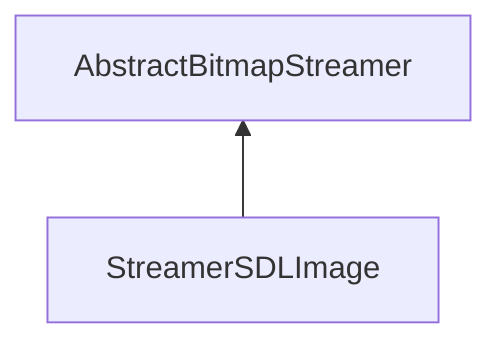

| public |
{:.api_label}

#### Inheritance Graph

## Description

## Public Functions

|
| ------: | ----------------- |
|  | |
|  | **[StreamerSDLImage](#classUtil_1_1StreamerSDLImage_1ac6a75ea6057d1bf50c93f2be0942a139)**() |
|  | |
|  | **[~StreamerSDLImage](#classUtil_1_1StreamerSDLImage_1ad04c707420f332b3eb77712735dd7797)**() |
|  | |
| [Reference](classUtil_1_1Reference) < [Bitmap](classUtil_1_1Bitmap) > | **[loadBitmap](#classUtil_1_1StreamerSDLImage_1a6bbe648e0fa610a41ec5a563e1640739)**(std::istream & void) |
{: .nohead .nowrap1 .api_section }

## Public Static Functions

|
| ------: | ----------------- |
|  | |
| bool | **[init](#classUtil_1_1StreamerSDLImage_1a9886814f5abe243f0164c177f8652fc6)**() |
{: .nohead .nowrap1 .api_section }

-------------------------------------------------------------------

## Documentation

### <small>function</small>  Util::StreamerSDLImage::StreamerSDLImage {#classUtil_1_1StreamerSDLImage_1ac6a75ea6057d1bf50c93f2be0942a139}

| public | inline |
{:.api_label}

|
| ------: | ----------------- |
|  |
|  **[StreamerSDLImage](#classUtil_1_1StreamerSDLImage_1ac6a75ea6057d1bf50c93f2be0942a139)**( |  ) |
{: .nohead .nowrap1 .api_doc }

Defined in `Util/Serialization/StreamerSDLImage.h:25`{:style="float: right"}

-------------------------------------------------------------------

### <small>function</small>  Util::StreamerSDLImage::~StreamerSDLImage {#classUtil_1_1StreamerSDLImage_1ad04c707420f332b3eb77712735dd7797}

| public | inline | virtual |
{:.api_label}

|
| ------: | ----------------- |
|  |
|  **[~StreamerSDLImage](#classUtil_1_1StreamerSDLImage_1ad04c707420f332b3eb77712735dd7797)**( |  ) |
{: .nohead .nowrap1 .api_doc }

Defined in `Util/Serialization/StreamerSDLImage.h:28`{:style="float: right"}

-------------------------------------------------------------------

### <small>function</small>  Util::StreamerSDLImage::loadBitmap {#classUtil_1_1StreamerSDLImage_1a6bbe648e0fa610a41ec5a563e1640739}

| public | virtual |
{:.api_label}

|
| ------: | ----------------- |
|  |
| [Reference](classUtil_1_1Reference) < [Bitmap](classUtil_1_1Bitmap) > **[loadBitmap](#classUtil_1_1StreamerSDLImage_1a6bbe648e0fa610a41ec5a563e1640739)**( | std::istream & | **void** ) |
{: .nohead .nowrap1 .api_doc }

Load a bitmap from the given stream.

#### Parameters
**input**
:  Use the data from the stream beginning at the preset position.

#### Returns
 [Bitmap](classUtil_1_1Bitmap) object. The caller is responsible for the memory deallocation.

Defined in `Util/Serialization/StreamerSDLImage.h:31`{:style="float: right"}

-------------------------------------------------------------------

### <small>function</small>  Util::StreamerSDLImage::init {#classUtil_1_1StreamerSDLImage_1a9886814f5abe243f0164c177f8652fc6}

| public | static |
{:.api_label}

|
| ------: | ----------------- |
|  |
| bool **[init](#classUtil_1_1StreamerSDLImage_1a9886814f5abe243f0164c177f8652fc6)**( |  ) |
{: .nohead .nowrap1 .api_doc }

Defined in `Util/Serialization/StreamerSDLImage.h:33`{:style="float: right"}

-------------------------------------------------------------------

