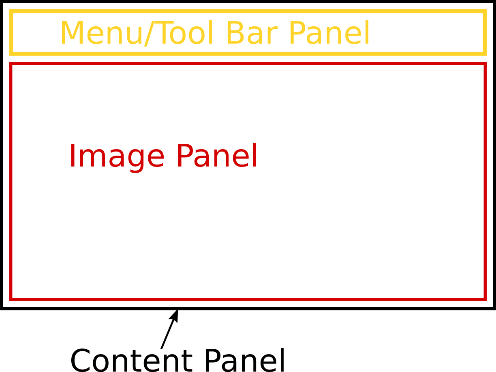

<!------------------------------------------------------------------------------------------------
This work is licensed under the Creative Commons Attribution-ShareAlike 4.0 International License.
 To view a copy of this license, visit http://creativecommons.org/licenses/by-sa/4.0/.
 Author: Florian Pieper (fpieper@mail.uni-paderborn.de)
 PADrend Version 1.0.0
------------------------------------------------------------------------------------------------->

In this tutorial and the following tutorials we will build a small image viewer.
It will be capable of showing images and browsing through a folder of images.
Also there will be a very basic drawing function.

## In this tutorial
In this tutorial we will build the user interface of the image viewer.

## Creating a window
Window creation in PADrend is simple.
All we have to do is to call the function _createWindow_.
It takes three parameters.
The first two are the width and height of the window, the third one sets the window's title.
We use the member function _setPosition_ to position the window within PADrend.

<!---INCLUDE src=ImageViewer1.escript, start=11, end=12--->

To open the window we have to call the member function _setEnabled_.

<!---INCLUDE src=ImageViewer1.escript, start=7, end=7--->

That is all we need to do to open an empty window.

## Creating the window's content
In PADrend panels are used as containers to group GUI elements.
The first thing we need to do is to create the basic layout by panels.
We will start with three of them.
One will hold the image, one is needed to hold the menu- and tool-bar.
The third panel will serve as content panel and contains the other two panels.
See the image below for the layout.

There are two techniques to create a UI element in PADrend.
We used the first way to create our window.
Therefore we called the _createWindow_ function.
There exist several functions to create other UI elements.
After we have created the element, we use its member functions to specialize it.
The other way is a descriptional one.
The UI element is described by an map, containing all necessary information.
The specialization of the element is also included in the map.
We will use both ways in the creation of our panels.
First of all we create the content panel by using the first technique.

<!---INCLUDE src=ImageViewer1.escript, start=14, end=20--->

The function _createPanel_ creates a panel having a width and a height.
We can also add flags (such as _GUI.BORDER_ for a panel with an outline) as additional argument.
In the next step we add layout information to the panel.
The layout information will be explained in detail in the next section.
The panels for the image and the controls will be created by the second technique.
Note that you can also use the _+=_ operator on a panel to add content to it.
In this way you can also pass a description as a list of maps to it.
Each map in the list describes one UI element.
In this way we add the panel for the controls to the content panel.

<!---INCLUDE src=ImageViewer1.escript, start=23, end=29--->

The map contains of predefined keys and values that describes the UI element.
Since we need a panel we set _GUI.TYPE_PANEL_ as value for _GUI.TYPE_.
We use _GUI.BORDER_ as flag, so that we see the border of the panel.
The keys _GUI.POSITION_ and _GUI.SIZE_ are used for the layouting of the panel.
At last we use _GUI.CONTENTS_ to add the controls to the panel.
The controls are created by two functions and will be explained in detail later.
The method above creates an anonymous panel.
Since we will not alter the panel there is no need to store it somewhere, so that leave it anonymous is fine.
However we need to change the image shown in the image panel, so that it can not be anonymous.
One way of creating it would be the function _createPanel_, but we can also _create_ which creates a UI element by a description.
The description is similar to the one for the controls panel.
We store the panel in an attribute so that we can access it later on.

<!---INCLUDE src=ImageViewer1.escript, start=31, end=39--->

In a last step we need to add the image panel to the content panel and the content panel to the window.
As explained before the _+=_ operator can be used to add content to a panel.
In addition you can also use the member function _add_.
First of all we add _GUI.TYPE_NEXT_ROW_ to the content panel to ensure the image panel is positioned under the control panel.
Afterwards we add the image panel to the content panel by using _add_.
In a last step we use _+=_ to add the content panel to the window.

<!---INCLUDE src=ImageViewer1.escript, start=41, end=43--->

### Layout information
