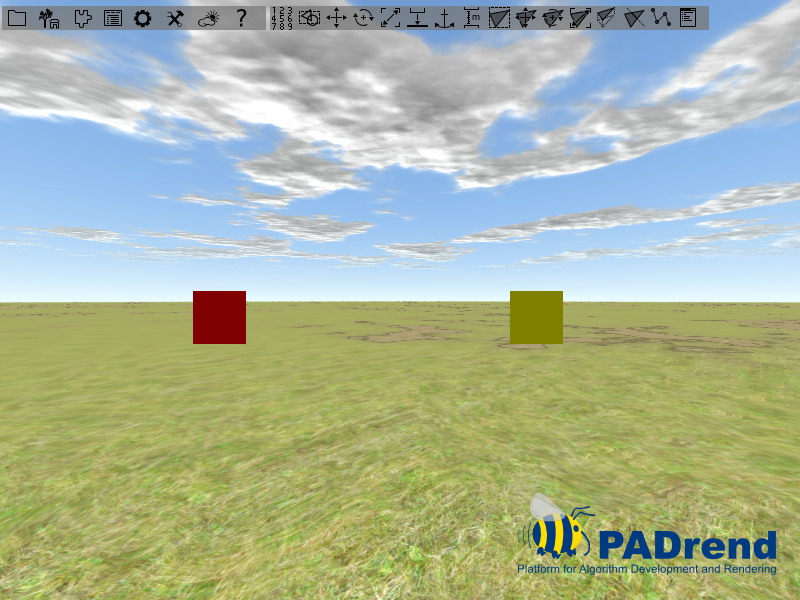

<!------------------------------------------------------------------------------------------------
This work is licensed under the Creative Commons Attribution-ShareAlike 4.0 International License.
 To view a copy of this license, visit http://creativecommons.org/licenses/by-sa/4.0/.
 Author: Florian Pieper (fpieper@mail.uni-paderborn.de)
 PADrend Version 1.0.0
------------------------------------------------------------------------------------------------->

# Goal of this tutorial
This tutorial shows an example usage of culling states.

# Back and front face culling
The time that is needed to render a frame depends on the number of polygons that must be rendered.
To reduce the time - in other words to achieve higher frame rates - polygons that are not visible to the viewer should not be rendered.
Finding all of this polygons is a computational expensive problem.
However, it is easy to find out which polygons of an object facing the viewer (front face) and which are turned away from him (back face).
Back facing polygons are not visible to the user, so that they do not need to be rendered.
To determine if a polygon is back facing, the angle between the viewing direction and the polygons normal is evaluated.
The angle is tested against a value to divide between front and back face.
This is done in the rendering pipeline.
Front face culling works analog.  
For some applications it is necessary to deactivate the back face culling.
A culling state can be used to change the culling mode of a node.

## Creating the scene
The scene contains of four squares.
Since squares are 2 dimensional objects they have a front and a back face.
Each one has a unique color to distinguish between them.
There is a function that creates a geometry node containing a square.
The color and the position of a square are passed by two parameters.

<!---INCLUDE src=CullFaceState.escript, start=37, end=41--->
<!---BEGINN_CODESECTION--->
<!---Automaticly generated section. Do not edit!!!--->
    //creating four squares, each having an unique color
    var node1 = createNodeWithRect(new Util.Color4f(1, 0, 0, 1), -3.5);
    var node2 = createNodeWithRect(new Util.Color4f(0, 1, 0, 1), -1.5);
    var node3 = createNodeWithRect(new Util.Color4f(0, 0, 1, 1), 0.5);
    var node4 = createNodeWithRect(new Util.Color4f(1, 1, 0, 1), 2.5);
<!---END_CODESECTION--->

Next up we create four culling states.
For the first three states the method _setCullMode_ is used to set the sates mode.
There are three cull modes which can be found in the namespace _Rendering_:
* _CULL\_BACK_ : Enables back face culling only.
* _CULL\_FRONT_ : Enables front face culling only.
* _CULL\_FRONT\_AND\_BACK_ : Enables front and back face culling.

<!---INCLUDE src=CullFaceState.escript, start=43, end=52--->
<!---BEGINN_CODESECTION--->
<!---Automaticly generated section. Do not edit!!!--->
    //different culling states
    //enable back face culling
    var stateCullBack = new MinSG.CullFaceState();
    stateCullBack.setCullMode(Rendering.CULL_BACK);
    //enable front face culling
    var stateCullFront = new MinSG.CullFaceState();
    stateCullFront.setCullMode(Rendering.CULL_FRONT);
     //enable front and back face culling
    var stateCullBoth = new MinSG.CullFaceState();
    stateCullBoth.setCullMode(Rendering.CULL_FRONT_AND_BACK);
<!---END_CODESECTION--->

To deactivate culling we create a cull state and call the method _setCullingEnabled_.
We pass _false_ to it.

<!---INCLUDE src=CullFaceState.escript, start=53, end=55--->
<!---BEGINN_CODESECTION--->
<!---Automaticly generated section. Do not edit!!!--->
    //disable culling
    var stateCullingOff = new MinSG.CullFaceState();
    stateCullingOff.setCullingEnabled(false);
<!---END_CODESECTION--->

Next up we add the states to the geometry nodes.

<!---INCLUDE src=CullFaceState.escript, start=57, end=61--->
<!---BEGINN_CODESECTION--->
<!---Automaticly generated section. Do not edit!!!--->
    //adding the states to the nodes
    node1.addState(stateCullBack);
    node2.addState(stateCullFront);
    node3.addState(stateCullBoth);
    node4.addState(stateCullingOff);
<!---END_CODESECTION--->

In a last step the scene graph is build and the scene gets activated.

## Result of the culling
The images below show the scene from the front side and the back side.
For the first square (the red one) back face culling was activated. so that it appears on the image showing the front side, but not on the one showing the back side.
For the green square front face culling was activated, which leads to the situation of the red square, but the other way around.
For the yellow square culling was turned off, which makes it appear on both images.
Since we used back and front face culling on the blue square, it can not be seen on the images.

