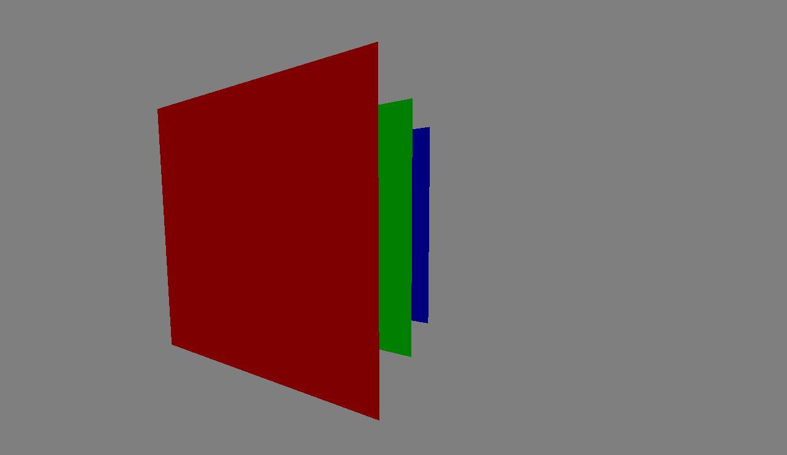
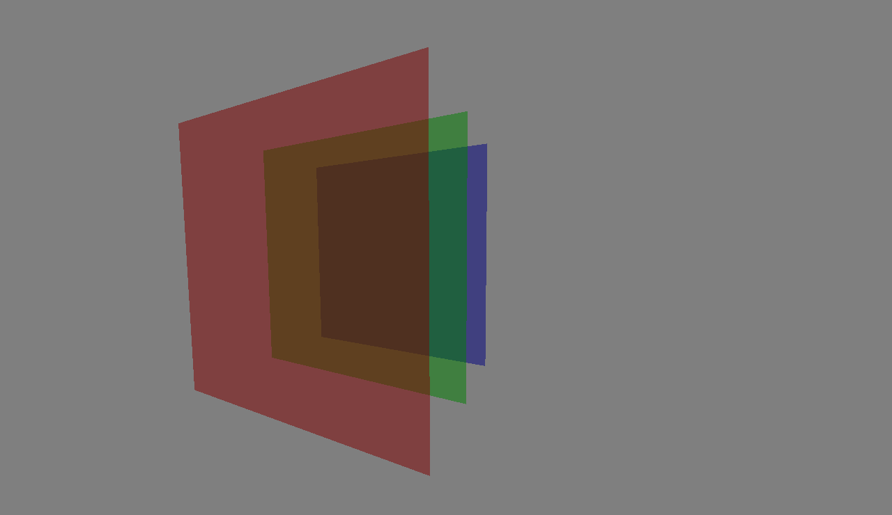

<!------------------------------------------------------------------------------------------------
This work is licensed under the Creative Commons Attribution-ShareAlike 4.0 International License.
 To view a copy of this license, visit http://creativecommons.org/licenses/by-sa/4.0/.
 Author: Stanislaw Eppinger (eppinger@mail.uni-paderborn.de)
 PADrend Version 1.0.0
------------------------------------------------------------------------------------------------->

# TransparencyRenderer
The *TransparencyRenderer* is a NodeRendererState which handles transparency of nodes. To see how the TransparencyRenderer works, let's take a look at a simple example.

## Simple Example
In this example we will create three quads with different color, an alpha value of 0.5 to be transparent and put them in front of each other. To create these quads we take the `buildMesh()` method from the ShaderState tutorial and provide a parameter for each color channel, to create quads with different colors.

<!---INCLUDE src=TransparencyRenderer.escript, start=17, end=17--->
<!---BEGINN_CODESECTION--->
<!---Automaticly generated section. Do not edit!!!--->
    var buildMesh = fn(r, g, b) {
<!---END_CODESECTION--->

We create a red, green and blue quad and displace them along the z-axis.

<!---INCLUDE src=TransparencyRenderer.escript, start=48, end=53--->
<!---BEGINN_CODESECTION--->
<!---Automaticly generated section. Do not edit!!!--->
    var geo = new MinSG.GeometryNode(buildMesh(1,0,0));
    var geo2 = new MinSG.GeometryNode(buildMesh(0,1,0));
    var geo3 = new MinSG.GeometryNode(buildMesh(0,0,1));
    // Displace the planes along the z-axis
    geo2.moveLocal(new Geometry.Vec3(0, 0, -3));
    geo3.moveLocal(new Geometry.Vec3(0, 0, -6));
<!---END_CODESECTION--->

Now we need to be careful where to put the TransparencyRenderer. It is a NodeRendererState and handels the rendering of all the nodes in the subtree. Therefore it needs to be places at our list node which then contains the quad's geometry node as children.

<!---INCLUDE src=TransparencyRenderer.escript, start=56, end=60--->
<!---BEGINN_CODESECTION--->
<!---Automaticly generated section. Do not edit!!!--->
    var sceneNode = new MinSG.ListNode();
    sceneNode += new MinSG.TransparencyRenderer();
    sceneNode += geo;
    sceneNode += geo2;
    sceneNode += geo3;
<!---END_CODESECTION--->

When we don't insert the TransparencyRenderer then the result will look like this:

The quads are simply overlapping each other without transparency, although everyone of them has an alpha value of 0.5. When we insert the TransparencyRenderer at the list node we will see the transparency effect:

