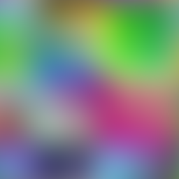
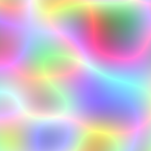

# TextureProcessor
A `TextureProcessor` converts some input textures into some output textures using a shader. It is just a wrapper for some simple `FBO` handling, but can simplify your code. The basic idea is that you only specify the input/output textures and the shader. The `TextureProcessor` will then take care of the rest.

This class is implemented as module: `LibRenderingExt/TextureProcessor`

So in order to use it, it might be a good idea to place the following line onto the start of your EScript file:
```
static TextureProcessor = Std.module('LibRenderingExt/TextureProcessor');
```

The basic usage is as follows:
```
(new TextureProcessor)
  .setInputTextures([myInputA,myInputB])
  .setOutputTexture( myColorTexture )
  .setOutputDepthTexture( myDepthTexture )
  .setShader(myShader)
  .execute();
```
Here just create an instance of the `TextureProcessor`, set some settings and finally call execute. Now a simple quad is rendered using the given shader and textures. The resulting color texture is rendered onto the `myColorTexture` and the depth texture onto `myDepthTexture`. The depth texture and the input textures are optional, but you must specify at least one output texture and one shader.

## Advanced usage
If you want to render not only a fullscreen quad, but more complex things, you could do so by using `begin` and `end` instead of only `execute`.
```

var tp = (new TextureProcessor)
  .setInputTextures([myInputA,myInputB])
  .setOutputTexture( myColorTexture )
  .setOutputDepthTexture( myDepthTexture );
tp.begin();
// render something, like a complete mesh
tp.end();
```

## Creating textures
There are several different ways to obtain a texture. Input textures are often loaded from file, therefore you would probably want to use this:
```
var myInput = Rendering.createTextureFromFile(file);
```
You could also create textures by using some other PADrend functions. The `alpha` parameter that is used by some functions, determines whether the texture should have an alpha channel or not. The `width` and `height` parameters are of course used to define the width and height of the texture in pixels.
* `Rendering.createRedTexture(Number width, Number height)`
 * create a completely red texture of the given size
* `Rendering.createChessTexture(Number width, Number height, Number tileSize)`
 * create a chess pattern with tiles of the size tileSize*tileSize
* `Rendering.createDepthTexture(Number width, Number height)`
  * creates a depth texture of the given size
* `Rendering.createHDRTexture(Number width, Number height, Bool alpha)`
 * creates an HDR texture of the given size. Each channel of an HDR texture is a real 32 floating point value.
* `Rendering.createStdTexture(Number width, Number height, Bool alpha)`
 * creates an ordinary texture of the given size. Each channel is used like a floating point value in the range [0, 1]. Of course each channel only stores an 8 bit value.
* `Rendering.createTextureFromBitmap(Util.Bitmap bmp, Bool clampToEdges = false)`
 * creates a texture from the given bitmap. If `clampToEdges` is true, the wrap mode of this texture is set to `clamp`. Of course you could also create a bitmap from a texture:
 * `createBitmapFromTexture(RenderingContext, Texture)`
* `Rendering.createNoiseTexture(Number width, Number height, Bool alpha, Number scaling = 1.0)`
 * creates a noise texture using Perlin Noise
* `Rendering.createTextureFromScreen([Rect screenRect, bool alpha = true] |  bool alpha = true)`
 * creates texture from a screenshot

## Example
This example will use the `execute` function to simply render a quad using the given shader. Therefore the vertex shader is only forwarding the position and texture coordinates:
```
var vertexShaderCode = "
void main(void){
  gl_TexCoord[0] = gl_MultiTexCoord0;
  gl_Position = ftransform();
}"
```

The fragment shader is of course more complex and depends on your goal. In this simple example we just modify the given input texture:
```
var fragmentShaderCode = "
#version 120
uniform sampler2D uTexture;
void main(void) {
	vec2 uv = gl_TexCoord[0].st;
	vec4 color = texture2D(uTexture, uv);
	color.rgb = 1 - abs(2 * color.rgb - 1);
	gl_FragColor = color;
}
";
```

Now we can create the corresponding shader and textures:
```
// create shader
var shader = Rendering.Shader.createShader(vertexShaderCode, fragmentShaderCode);

// create input and output textures
var input = Rendering.createNoiseTexture(1024, 1024, false, 0.01);
var output = Rendering.createStdTexture(1024, 1024, true);
```

Afterwards we just execute the `TextureProcessor` and save the result:
```
// create and execute TextureProcessor
(new TextureProcessor)
	.setInputTextures([input])
	.setOutputTexture(output)
	.setShader(shader)
	.execute();

// just save the result to the filesystem
Rendering.saveTexture(renderingContext, output, "presets/output.png");
```

The input texture is a noise texture and looks like the left image. Our shader will now convert this input texture to the right image:




The complete code can be found here: [TextureProcessorExample.escript](TextureProcessorExample.escript)
