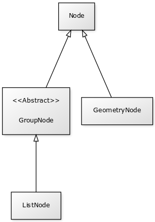

<!------------------------------------------------------------------------------------------------
This work is licensed under the Creative Commons Attribution-ShareAlike 4.0 International License.
 To view a copy of this license, visit http://creativecommons.org/licenses/by-sa/4.0/.
------------------------------------------------------------------------------------------------->

# Goal of this tutorial
This tutorial is about PADrend's scene graph.
You will learn to create a simple scene graph and register it to PADrend, so that it is displayed as active scene.

# MinSG
MinSG stands for minimal scene graph and represents the scene graph of PADrend.
Even it is statet to be minimal MinSG is very powerful.
The graph can be created by different nodes.
This tutorial concentrates on two node types and gives a simple example of creating a scene by using MinSG.

## Node class hierarchy

The base class of scene graph nodes is called _Node_.
It provides method that are common for all type of nodes.
For this tutorial we also need object of the class _ListNode_.
They are used as the inner nodes of the scene graph.
List nodes contain a list of child nodes.
Nodes can be added and removed dynamically.
The class of last type of nodes we need is _GeometryNode_.
A geometry node is capable of holding a mesh which is displayed when the node is traversed by the renderer.
Geometry nodes are leaf nodes in the scene graph.

### MinSG.Node

### MinSG.ListNode

### MinSG.GeometryNode

## Creating a simple scene graph
Lets create a scene graph made of five nodes.
This is only a structural example of a scene graph.
The graph will not contain geometry.

<!---INCLUDE src=SceneCreation.escript, start=14, end=19--->
<!---BEGINN_CODESECTION--->
<!---Automaticly generated section. Do not edit!!!--->
    var rootNode = new MinSG.ListNode();
    var listNode = new MinSG.ListNode();
    
    var geometryNode1 = new MinSG.GeometryNode();
    var geometryNode2 = new MinSG.GeometryNode();
    var geometryNode3 = new MinSG.GeometryNode();
<!---END_CODESECTION--->

First we need to create the nodes themselves.
This is simply done by instantiating objects.
For our scene we need two objects of the class _MinSG.ListNode_ and three of the class _MinSG.GeometryNode_.
Next up we connect the nodes to a tree similar to the one in the image bellow.

The simplest way to attach a node to a list node is by using  _+=_ operator.
But you can also use the method _addChild_.
The graph is created by adding _listNode_ and one of the geometry nodes to the root node.
Afterwards the two other geometry nodes are connected to the list node.

<!---INCLUDE src=SceneCreation.escript, start=21, end=26--->
<!---BEGINN_CODESECTION--->
<!---Automaticly generated section. Do not edit!!!--->
    //Building the scene graph
    rootNode.addChild(geometryNode1);
    rootNode.addChild(listNode);
    
    listNode += geometryNode2;
    listNode += geometryNode3;
<!---END_CODESECTION--->

## Providing meta data
The last step of this tutorial is to register the scene graph to PADrend, which will treat it as a scene.
Before we do that lets attach some meta data to the scene.
This step is optional, however it can be important to provide this information (i.e. for license reasons).
The meta data fields that can be set are:

* Title: The title of the scene.
* Creation Date: When was the scene created?
* Author: Who created the scene?
* License: The license the scene is shipped with. Possible values are "free", "internal use" and "RESTRICTED".
* Note: Some information about the scene.

Before we can set the meta data we first need to load the module containing the necessary functions.

<!---INCLUDE src=SceneCreation.escript, start=29, end=29--->
<!---BEGINN_CODESECTION--->
<!---Automaticly generated section. Do not edit!!!--->
    var NodeMetaInfo = Std.module('LibMinSGExt/NodeMetaInfo');
<!---END_CODESECTION--->

For setting the current date, we first need to fetch it.

<!---INCLUDE src=SceneCreation.escript, start=30, end=30--->
<!---BEGINN_CODESECTION--->
<!---Automaticly generated section. Do not edit!!!--->
    var date = getDate();
<!---END_CODESECTION--->

For each field the class _NodeMetaInfo_ contains a function to access it.
Each of these functions returns a data wrapper that can be used to set or read the field.
The node which should contain the meta data is passed as parameter.
We want to attach the meta data to the root node of our scene (_rootNode_).

<!---INCLUDE src=SceneCreation.escript, start=32, end=36--->
<!---BEGINN_CODESECTION--->
<!---Automaticly generated section. Do not edit!!!--->
    NodeMetaInfo.accessMetaInfo_CreationDate(rootNode)("" + date["year"] + "-"+ date["mon"] + "-" + date["mday"] );
    NodeMetaInfo.accessMetaInfo_Title(rootNode)("Test Scene");
    NodeMetaInfo.accessMetaInfo_Author(rootNode)("Max Mustermann");
    NodeMetaInfo.accessMetaInfo_License(rootNode)("free");
    NodeMetaInfo.accessMetaInfo_Note(rootNode)("Some info about the scene.");
<!---END_CODESECTION--->

## Registering the scene to PADrend
Lets register the scene and tell PADrend to display it.
Therefore PADrend offers the two functions _registerScene_ and _selectScene_.
We simply call first register and then select and pass the root node of our scene graph to them.

<!---INCLUDE src=SceneCreation.escript, start=38, end=41--->
<!---BEGINN_CODESECTION--->
<!---Automaticly generated section. Do not edit!!!--->
    //Register the root node of the scene graph
    PADrend.registerScene(rootNode);
    //Selecting the root node to be the active scene
    PADrend.selectScene(rootNode);
<!---END_CODESECTION--->

If our scene would contain some geometry it would now be displayed.
You can use PADrend's _Main_-window to check the structure of the scene graph.

