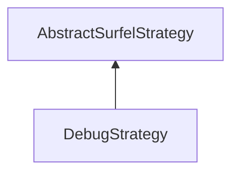

#### Inheritance Graph

## Functions

|
| ------------------------------------------------------------------------------------------------------------------------------------------------: | ------------------------ | 
| **_constructor**()                                                                                                                                | [ESMF] new DebugStrategy | 
| **[getFixSurfels](classMinSG_1_1BlueSurfels_1_1DebugStrategy#classMinSG_1_1BlueSurfels_1_1DebugStrategy_1a507088cd98467dfccaf2f222ecb1a841)**()   |                          | 
| **getHideSurfels**()                                                                                                                              |                          | 
| **[setFixSurfels](classMinSG_1_1BlueSurfels_1_1DebugStrategy#classMinSG_1_1BlueSurfels_1_1DebugStrategy_1a9bad476421b2bc6f79fbfe78cd942191)**(p0) |                          | 
| **setHideSurfels**(p0)                                                                                                                            |                          | 
{: .nohead .nowrap1 }

