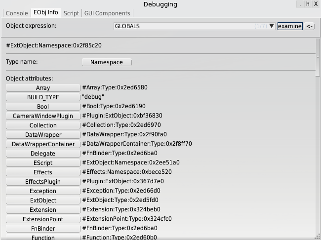
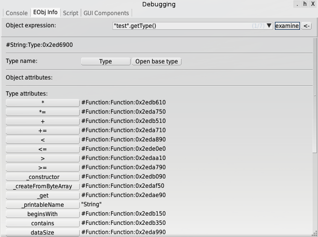
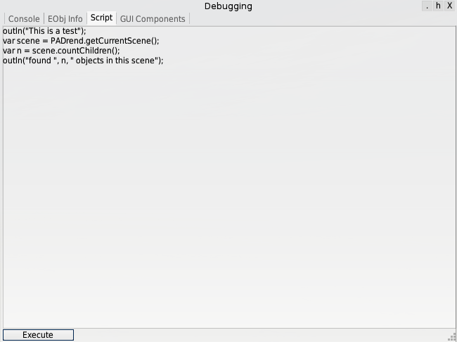
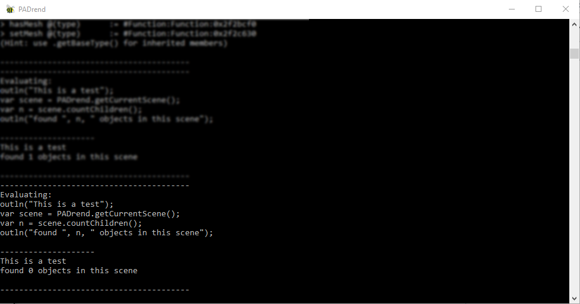
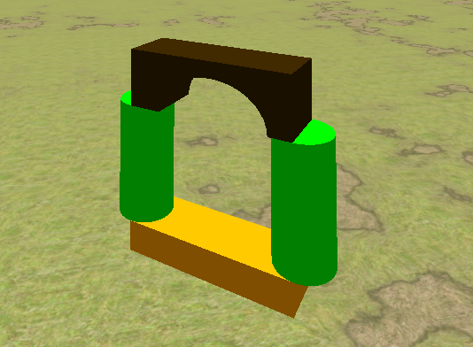

<!------------------------------------------------------------------------------------------------
This work is licensed under the Creative Commons Attribution-ShareAlike 4.0 International License.
 To view a copy of this license, visit http://creativecommons.org/licenses/by-sa/4.0/.
 Author: Henrik Heine (hheine@mail.uni-paderborn.de)
 PADrend Version 1.0.0
------------------------------------------------------------------------------------------------->
<!---BEGINN_INDEXSECTION--->
<!---Automaticly generated section. Do not edit!!!--->
# Overview
* 2 User Guide
    * 2.1 [Scene loading and navigation](../../2_User_Guide/1_Scene_loading_and_navigation/Scene_loading_and_navigation.html)
    * 2.2 [Scene Building](../../2_User_Guide/2_Scene_Building/Scene_Building.html)
    * 2.3 [Basic Animation](../../2_User_Guide/3_Basic_Animation/Basic_Animation.html)
    * 2.4 [Functional Objects and Physics](../../2_User_Guide/4_Functional_Objects_and_Physics/Functional_Objects_and_Physics.html)
    * 2.5 [Functional Objects Pointing Joint](../../2_User_Guide/5_Functional_Objects_Pointing_Joint/Functional_Objects_Pointing_Joint.html)
    * 2.6 [Using Scripts](../../2_User_Guide/6_Using_Scripts/Using_Scripts.html)
    * 2.7 [Object Factories](../../2_User_Guide/7_Object_Factories/Object_Factories.html)
<!---END_INDEXSECTION--->

# Goal of this tutorial
This is a further tutorial on functional objects and moreover on runtime scripting and debugging. We want to modify parts of the scene via a debug script inside PADrend. This can be useful for exact positioning.

# Assumptions
All previous tutorials are finished. PADrend is opened without any specific scene loaded. Infinite ground and dynamic sky are enabled. The *ObjectFactories* plugin is activated. You should know at least some EScript basics.

# Getting started with runtime scripting
First open the debug window, by clicking on *Plugins* -> *Debug Tools*. The debug windows consists of 4 tabs, but we are only interested in two of them, the *EObj Info* and the *Script* tab.

## EObj Info
This tab help us to lookup all attributes of any EScript object. In the dropdown box you can select any of the given expressions or just enter one by yourself. We start by selecting the `GLOBALS` expression and clicking on *examine*. We now get a list of all global variables of PADrend.



You can now see the type of the given expressions (GLOBALS is of type `Namespace`) and a list of all object attributes. Each line corresponds to one attribute. The button shows the name of the attribute and the label contains the string representation of the given attribute. You can click on any button in order to inspect the object represented by that button. For example lets assume we want to know more about the `Array` attribute of GLOBALS. To do so, just click on it and you will notice that the object expression has changed to `GLOBALS.Array`. Unfortunately it is not possible to see the arguments of a function, instead you only see that it is a function and nothing more.

To get back to the parent expression, you can use the `<-` button, which will strip the last part after the dot. So `GLOBALS.Array` will again become `GLOBALS`. Instead of only using the expressions of the combobox and clicking around, you can also enter any valid expression yourself and hit the *examine* button. For example you could enter the following expression, in order to get more information about the string type: `"test".getType()`



## Script
The other important tab is the *Script* tab. It will allow you to type and execute EScript code at runtime. This is especially useful if you want make some small changes to current scene and don't want to create and execute an extra script file to do so. Enter any valid EScript code here and press *Execute*. Your typed code as well as any outputs and errors are shown on the console.




This code will will get the current scene object and print the number of root objects to the console.

# Exact positioning with scripts
Up to now the positioning of objects was very unprecise, because we dropped an object to the scene and moved it with the cursor. Now we want to create a simple script that will move the selected object to a specific position in 3D space. To do so, we open the script tab of the debugging windows and start programming:
```JavaScript
var Vec3 = Geometry.Vec3;
var node = NodeEditor.getSelectedNode();
if(node) node.setRelPosition(new Vec3(0,0,0));
```
The first line is only used convenience, because now we can use the short term `Vec3` instead of the full qualified name `Geometry.Vec3`. The `NodeEditor` object will give us access to many functions of the node editor itself. Here we only use a function to query the current selected node of the editor. If no node is selected, it will return `null`. The last line will then first check if the node exists (if it is not null), and if so, it will set the nodes relative position to the given argument. In this example we will set the nodes position to the origin of its parent. To test this, we can add any object to scene and try it out.
Instead of setting the position relative to its parent, we could also set the position in world space, by simply using the function: `setWorldPosition`

## Precise house
Now we want to build a house again, but instead of inaccurate placement, we use scripting to place everything at exact positions.
First we drop a bare brick to the scene (*ToyBlock4.mmf*) and use our small script to set its position to (0, 0, 0). Next we want to place some pillars onto this brick, but for exact positioning, we need to know the dimensions of this brick. To query them, we get the bounding box of the brick and print all dimensions to the console:
```JavaScript
var Vec3 = Geometry.Vec3;
var node = NodeEditor.getSelectedNode();
if(node) outln(node.getWorldBB());
```
As a result we get this output:
```
Box(c=0 0.25 0,w=3,h=0.5,d=1)
```
The bounding box of our brick has a width (x-axis) of 3 units, a height (y-axis) of 0.5 units and a depth (z-axis) of one unit. The center of it is at (0, 0.25, 0). With some brain juice we now know that the left border of the brick is at -1.5 and the right border at 1.5. Now we add a pillar (*ToyBlock3.mmf*) and use a script to place it at (-1.5, 0.5, 0). We place another pillar at the opposite side at (1.5, 0.5, 0).
Next we want to add a roof. To do so, we need to know the height of the pillars. We again use the bounding box to print the dimensions:
```
Box(c=-3.18543 1 0.155122,w=1,h=2,d=0.996584)
```
This time the values are a bit ugly, but at least the important value, the height, is a nice number.
The base brick has a height of 0.5 units and the pillar is 2 units high. So we can now place the roof (*ToyBlock1.mmf*) at (0, 2.5, 0).

