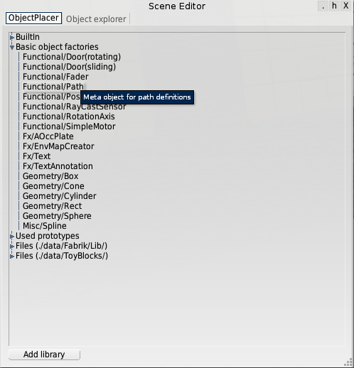
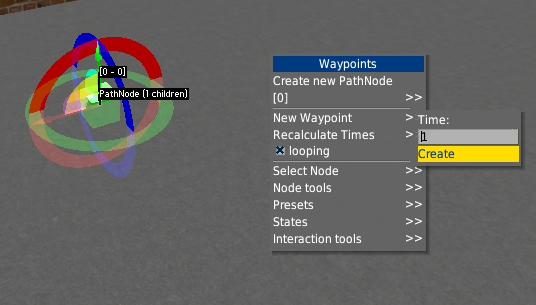
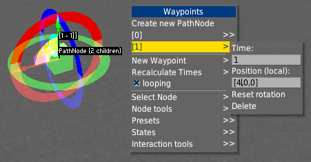
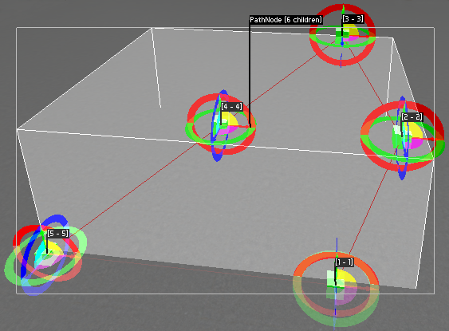

<!------------------------------------------------------------------------------------------------
This work is licensed under the Creative Commons Attribution-ShareAlike 4.0 International License.
 To view a copy of this license, visit http://creativecommons.org/licenses/by-sa/4.0/.
 Author: Henrik Heine (hheine@mail.uni-paderborn.de)
 PADrend Version 1.0.0
------------------------------------------------------------------------------------------------->
<!---BEGINN_INDEXSECTION--->
<!---Automaticly generated section. Do not edit!!!--->
# Overview
* 2 User Guide
    * 2.1 [Scene loading and navigation](../../2_User_Guide/1_Scene_loading_and_navigation/Scene_loading_and_navigation.html)
    * 2.2 [Scene Building](../../2_User_Guide/2_Scene_Building/Scene_Building.html)
    * 2.3 [Basic Animation](../../2_User_Guide/3_Basic_Animation/Basic_Animation.html)
    * 2.4 [Functional Objects and Physics](../../2_User_Guide/4_Functional_Objects_and_Physics/Functional_Objects_and_Physics.html)
    * 2.5 [Functional Objects Pointing Joint](../../2_User_Guide/5_Functional_Objects_Pointing_Joint/Functional_Objects_Pointing_Joint.html)
    * 2.6 [Using Scripts](../../2_User_Guide/6_Using_Scripts/Using_Scripts.html)
    * 2.7 [Object Factories](../../2_User_Guide/7_Object_Factories/Object_Factories.html)
    * 2.8 [Camera Path](../../2_User_Guide/8_Camera_Path/Camera_Path.html)
<!---END_INDEXSECTION--->

# Goal of this tutorial
This is a further tutorial on functional objects and moreover on extending the *ObjectFactories* plugin. In detail we want to add custom objects we can place from the *ObjectPlacer* window.

# Assumptions
All previous tutorials are finished. PADrend is opened without any specific scene loaded. Infinite ground and dynamic sky are enabled. The *ObjectFactories* plugin and the *Waypoints* plugin should be activated. You should know at least some EScript basics.

# Why do we want to extend the plugin?
It is not necessary to do so, but it might be easier. Sometimes it might happen that one needs a specific behaviour quiet often. So instead of always building this specific node always from scratch, it might be better to define it inside the *ObjectFactories* plugin, in order to create a complete instance from the *ObjectPlacer* window. Imagine you have to build the *SimpleMotor* object always from scratch by creating a new Cube, adding the `MetaObjectTrait` and the `ContinuousAnimator`. This would be really annoying, therefor it is implemented in the *ObjectPlacer*.

# Creating a path node
One important thing that is missing in the *ObjectPlacer* is the `PathNode`. This node is really useful if one wants to let an object move along a specific path. In order to add new objects to the plugin, we have to write two files. Navigate to `PADrend/plugins/ObjectFactories/Factories` and create two files: `Path.info` and `Path.escript`.
The plugin will inspect all info files inside this directory on startup and use them to display some meta information, like the description and the name of the object. It also defines the name of the actual script file, in this case it is `"./Path"`, which refers to our `Path.escript` file. Our `Path.info` file will look like this:
```JavaScript
{
	"moduleId" : "./Path",
	"description" : "Meta object for path definitions",
	"displayName" : "Functional/Path"
}

```

Furthermore we need an escript file, which will generate our objects:
```JavaScript
return fn() {
	static tools = module('../InternalTools');

	var node = new MinSG.PathNode();
	node.createWaypoint(new Geometry.SRT(), 0);

	module('LibMinSGExt/SemanticObject').markAsSemanticObject(node);

	tools.registerNodeWithUniqueId(node,"Path");

	return node;
};

```
This script can be as complex as you want it to be, the only important thing is, that it must return a function that is able to create a node. In this example we first import the `InternalTools` module. It is not necessary, but it will give us some nice utility functions. In our case we only use the `registerNodeWithUniqueId` function. This function will give our node a nice and unique name. This is useful, because links between nodes will be defined by their IDs and therefor it is better to give a node a good name, which describes its function.
We basically just create a new `PathNode` with a single waypoint. Each waypoint consists of a `Scale`, `Rotation`, `Translation` and a time. The first three are vectors given by the `SRT` object. The last one is just a number given to the constructor, the very first waypoint should always be using time 0. Before we can return the newly created node, we should mark this node as a semantic object, because it will be used as a semantic unit, consisting of multiple waypoints. Furthermore we want it to show up in the *Object Explorer* tab and only semantic objects will be shown there.

Now we only have to save those two files and restart PADrend.

## Placing a path node
We now can open the *ObjectPlacer* tab of the *Scene Editor* and our new path node object will show up under the *Basic object factories* entry.

We can drag and drop it into the scene view just like any other object from the placer tab.
To actually see the path node we should switch to `PathEditor`. It is just another interactive tool, which will show all waypoints and which will be used in order to add new waypoints.


## Creating a path
Now we want to create a simple path animation. To do so, we first create some waypoints and after that we will let a cube move along the defined path.
If not yet done, place a `Functional/Path` object into the scene and give it a nice ID, like `ItemPath`. It already contains a single waypoint, but for a nice animation we want to have more waypoints. To create a new waypoint the PathEditor must be active. Now click with your right mouse button and select `New Waypoint` and then `Create`.

Now you have to move this waypoint to another position. To do so you can use the arrows and drag it around or you can make a right click, select the node you want to edit and change its local position. I prefer the last way, because it gives us precise control. Change the position some other value, like (4, 0, 0).

Create some more waypoints and make a simple path with them. If you want to make a nice looping animation, your last waypoint should be at the same position as your first waypoint. In this example a used 6 waypoints:
1. (0, 0, 0)
2. (4, 0, 0)
3. (5, 1,-2)
4. (4, 2, -4)
5. (2, 1, -2)
6. (0, 0, 0)



## Creating an animation
Now we have to add something that should move along the defined path. For the sake of simplicity we will use a simple cube. Open up the *Object Placer* and drop a `Geometry/Box` from the *Basic object factories* entry. Give this cube some nice ID, like *MovingItem*. You should also add a `Functional/SimpleMotor` to the scene. This object will drive our animation. Give it also a nice name, like `ItemMotor`.
The core of the path animation is the `PathAnimationTrait`. Add this trait to your box, by selecting the box and clicking on *Add object trait*. Next we have to set up all links. In our case we need two links. The first link will connect the box to our path. The easiest way to establish the connection is to select the path and then click on the *Add link* button from our box and select `pathNode`. The second link will connect the box with our motor. To do so, select the motor and click on the *Add link* button of our box object and select `animator`.
We want to have a looping animation, therefore we have to check the *Rep. anim* checkbox of the `PathAnimationTrait`.
We can now select the motor again and click on the *play* button. The box will move along the defined path.
