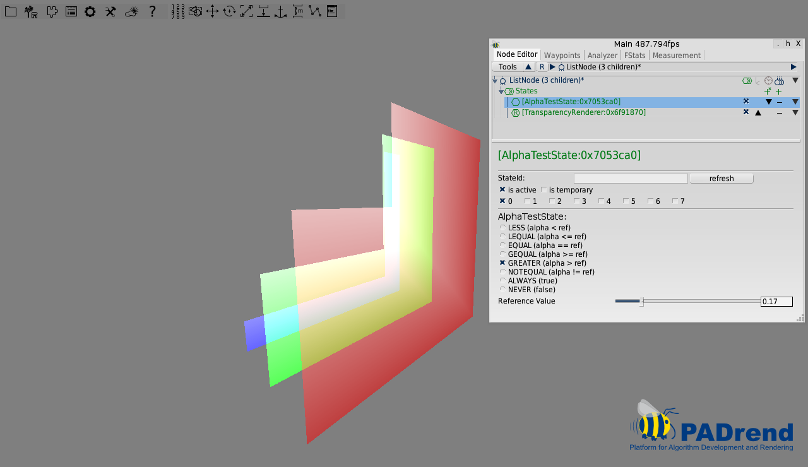

<!------------------------------------------------------------------------------------------------
This work is licensed under the Creative Commons Attribution-ShareAlike 4.0 International License.
 To view a copy of this license, visit http://creativecommons.org/licenses/by-sa/4.0/.
 Author: Stanislaw Eppinger (eppinger@mail.uni-paderborn.de)
 PADrend Version 1.0.0
------------------------------------------------------------------------------------------------->
<!---BEGINN_INDEXSECTION--->
<!---Automaticly generated section. Do not edit!!!--->
# Overview
* 3.1.5.2 Node States
    * 3.1.5.2.1 [Introduction to States](../../../../../3_Development_Guide/1_EScript/5_MinSG/2_Node_States/1_Introduction_to_States.html)
    * 3.1.5.2.2 [AlphaTestState](../../../../../3_Development_Guide/1_EScript/5_MinSG/2_Node_States/2_Alpha_Test_State/AlphaTestState.html)
    * 3.1.5.2.3 [BlendingState](../../../../../3_Development_Guide/1_EScript/5_MinSG/2_Node_States/3_Blending_State/BlendingState.html)
    * 3.1.5.2.4 [CullFaceState](../../../../../3_Development_Guide/1_EScript/5_MinSG/2_Node_States/4_Cull_Face_State/CullFaceState.html)
    * 3.1.5.2.5 [GroupState](../../../../../3_Development_Guide/1_EScript/5_MinSG/2_Node_States/5_Group_State/GroupState.html)
    * 3.1.5.2.6 [LightingState](../../../../../3_Development_Guide/1_EScript/5_MinSG/2_Node_States/6_Lighting_State/LightingState.html)
    * 3.1.5.2.7 [MaterialState](../../../../../3_Development_Guide/1_EScript/5_MinSG/2_Node_States/7_Material_State/MaterialState.html)
    * 3.1.5.2.8 [NodeRendererState](../../../../../3_Development_Guide/1_EScript/5_MinSG/2_Node_States/8_Node_Renderer_State/NodeRendererState.html)
    * 3.1.5.2.9 [PolygonModeState](../../../../../3_Development_Guide/1_EScript/5_MinSG/2_Node_States/9_Polygon_Mode_State/PolygonModeState.html)
    * 3.1.5.2.10 [ScriptedStates](../../../../../3_Development_Guide/1_EScript/5_MinSG/2_Node_States/10_Scripted_State/ScriptedStates.html)
    * 3.1.5.2.11 [ShaderState](../../../../../3_Development_Guide/1_EScript/5_MinSG/2_Node_States/11_Shader_State/ShaderState.html)
    * 3.1.5.2.12 [ShaderUniformState](../../../../../3_Development_Guide/1_EScript/5_MinSG/2_Node_States/12_Shader_Uniform_State/ShaderUniformState.html)
    * 3.1.5.2.13 [Texturing](../../../../../3_Development_Guide/1_EScript/5_MinSG/2_Node_States/13_Texturing_State/Texturing.html)
    * 3.1.5.2.14 [TransparencyRenderer](../../../../../3_Development_Guide/1_EScript/5_MinSG/2_Node_States/14_TransparencyRenderer/TransparencyRenderer.html)
<!---END_INDEXSECTION--->

# AlphaTestState
The AlphaTestState deals with alpha values and decides whether to display it or not. To understand this state it's best to take a look at a simple example.

## Simple Example
For this example we will take the example from the TransparencyRenderer and create three different quads displaced from each other with different alpha values.

<!---INCLUDE src=AlphaTestState.escript, start=49, end=51--->
<!---BEGINN_CODESECTION--->
<!---Automaticly generated section. Do not edit!!!--->
    var geo = new MinSG.GeometryNode(buildMesh(1,0,0,0.5));
    var geo2 = new MinSG.GeometryNode(buildMesh(0,1,0,0.3));
    var geo3 = new MinSG.GeometryNode(buildMesh(0,0,1,0.2));
<!---END_CODESECTION--->

To make it more interesting we set the color of the upper left corner of our quads to be (1, 1, 1, 0), i.e. a white color without transparency.

<!---INCLUDE src=AlphaTestState.escript, start=36, end=40--->
<!---BEGINN_CODESECTION--->
<!---Automaticly generated section. Do not edit!!!--->
    
        // Vertex 3:
        mb.position(new Vec3(0,10,0));
        mb.texCoord0(new Vec2(0,0));
        mb.addVertex();
<!---END_CODESECTION--->

The result will look like this:

Due to interpolation of the color value across the quad performed by the GPU, the alpha value decreases from the upper left corner to the bottem right corner of the quads.   
The AlphaTestState is added before the TransparencyRenderer to take effect:

<!---INCLUDE src=AlphaTestState.escript, start=59, end=60--->
<!---BEGINN_CODESECTION--->
<!---Automaticly generated section. Do not edit!!!--->
    sceneNode += new MinSG.AlphaTestState();
    sceneNode += new MinSG.TransparencyRenderer();
<!---END_CODESECTION--->

Now you can go ahead and play around with the Reference Value and the options in the AlphaTestState. In our example we take the GREATER option and set the Reference Value to 0.17 telling the AlphaTestState to only draw pixels with an alpha value higher than 0.17. We can see how the upper left corner of all three quads isn't drawn because the interpolated alpha values are below our Reference Value. You can try out other options and see how the state changes the rendering

