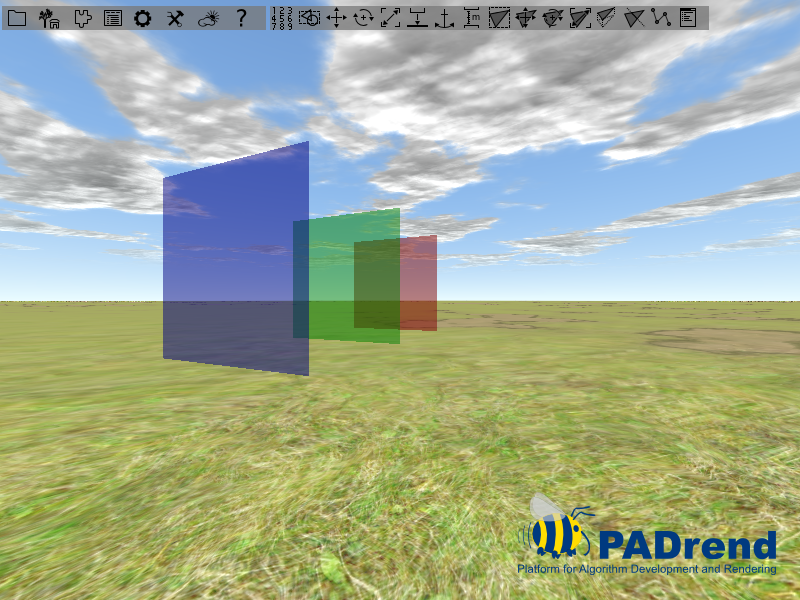
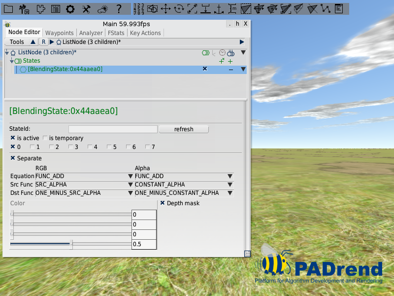

<!------------------------------------------------------------------------------------------------
This work is licensed under the Creative Commons Attribution-ShareAlike 4.0 International License.
 To view a copy of this license, visit http://creativecommons.org/licenses/by-sa/4.0/.
 Author: Florian Pieper (fpieper@mail.uni-paderborn.de)
 PADrend Version 1.0.0
------------------------------------------------------------------------------------------------->
<!---BEGINN_INDEXSECTION--->
<!---Automaticly generated section. Do not edit!!!--->
# Overview
* 3.1.5.2 Node States
    * 3.1.5.2.1 [Introduction to States](../../../../../3_Development_Guide/1_EScript/5_MinSG/2_Node_States/1_Introduction_to_States.html)
    * 3.1.5.2.2 [AlphaTestState](../../../../../3_Development_Guide/1_EScript/5_MinSG/2_Node_States/2_Alpha_Test_State/AlphaTestState.html)
    * 3.1.5.2.3 [BlendingState](../../../../../3_Development_Guide/1_EScript/5_MinSG/2_Node_States/3_Blending_State/BlendingState.html)
    * 3.1.5.2.4 [CullFaceState](../../../../../3_Development_Guide/1_EScript/5_MinSG/2_Node_States/4_Cull_Face_State/CullFaceState.html)
    * 3.1.5.2.5 [GroupState](../../../../../3_Development_Guide/1_EScript/5_MinSG/2_Node_States/5_Group_State/GroupState.html)
    * 3.1.5.2.6 [LightingState](../../../../../3_Development_Guide/1_EScript/5_MinSG/2_Node_States/6_Lighting_State/LightingState.html)
    * 3.1.5.2.7 [MaterialState](../../../../../3_Development_Guide/1_EScript/5_MinSG/2_Node_States/7_Material_State/MaterialState.html)
    * 3.1.5.2.8 [NodeRendererState](../../../../../3_Development_Guide/1_EScript/5_MinSG/2_Node_States/8_Node_Renderer_State/NodeRendererState.html)
    * 3.1.5.2.9 [PolygonModeState](../../../../../3_Development_Guide/1_EScript/5_MinSG/2_Node_States/9_Polygon_Mode_State/PolygonModeState.html)
    * 3.1.5.2.10 [ScriptedStates](../../../../../3_Development_Guide/1_EScript/5_MinSG/2_Node_States/10_Scripted_State/ScriptedStates.html)
    * 3.1.5.2.11 [ShaderState](../../../../../3_Development_Guide/1_EScript/5_MinSG/2_Node_States/11_Shader_State/ShaderState.html)
    * 3.1.5.2.12 [ShaderUniformState](../../../../../3_Development_Guide/1_EScript/5_MinSG/2_Node_States/12_Shader_Uniform_State/ShaderUniformState.html)
    * 3.1.5.2.13 [Texturing](../../../../../3_Development_Guide/1_EScript/5_MinSG/2_Node_States/13_Texturing_State/Texturing.html)
    * 3.1.5.2.14 [TransparencyRenderer](../../../../../3_Development_Guide/1_EScript/5_MinSG/2_Node_States/14_TransparencyRenderer/TransparencyRenderer.html)
<!---END_INDEXSECTION--->

# Goal of this tutorial
This tutorial shows an example usage of blending states and gives an short explanation of blending.

# Blending
As you may know when rendering colors are set in the frame buffer.
Whenever there is an object that is closer to the camera than the current color in the frame buffer, the color gets replaced by the objects color.
If using blending the color of the frame buffer and the objects color are combined.
This is important in rendering transparent objects.

## Blending Equation and Functions
This section is a summary of a book chapter.
You can find the complete chapter [here](http://www.informit.com/articles/article.aspx?p=1616796&seqNum=5).  
The mixing of the colors is done by the blending equation.
In the following the color that can be found in the frame buffer is called destination color and the color the new object is called source color.
PADrend offers three different blending equations which can be set by the constants FUNC_ADD, FUNC_SUBTRACT  and FUNC_REVERSE_SUBTRACT.
In the following FUNC_ADD is used to explain the blending equation.
The other equations are similar and will be introduced later.
FUNC_ADD is defined as follows:  

Cf = (Cs \* S) + (Cd \* D)

Where:
* Cf: is the resulting color
* Cs: is the source color
* Cd: is the destination color
* S: is the source blending factor
* D: is the destination blending factor

You can influence the resulting color by setting the blending factors.
In PADrend these are called _Src Func_ and _Dst Func_.
You can set the factors for blending the color and blending the alpha values indepndently.
The blending functions are represented by an enum.
In the following you can see which blending factors the enum values represent.

|Function                |RGB Blend Factor        |Alpha Blend Factor|
|------------------------|------------------------|------------------|
|ZERO                    |(0, 0, 0)               |0                 |
|ONE                     |(1, 1, 1)               |1                 |
|SRC_COLOR               |(Rs, Gs, Bs)            |As                |
|ONE_MINUS_SRC_COLOR     |(1, 1, 1) - (Rs, Gs, Bs)|1 - As            |
|SRC_ALPHA               |(As, As, As)            |As                |
|ONE_MINUS_SRC_ALPHA     |(1, 1, 1) - (As, As, As)|1 - As            |
|DST_ALPHA               |(Ad, Ad, Ad)            |Ad                |
|ONE_MINUS_DST_ALPHA     |(1, 1, 1) - (Ad, Ad, Ad)|1 - Ad            |
|DST_COLOR               |(Rd, Gd, Bd)            |Ad                |
|ONE_MINUS_DST_COLOR     |(1, 1, 1) - (Rd, Gd, Bd)|1 - Ad            |
|SRC_ALPHA_SATURATE      |(f, f, f)               |1                 |
|CONSTANT_COLOR          |(Rc, Gc, Bc)            |Ac                |
|ONE_MINUS_CONSTANT_COLOR|(1, 1, 1) - (Rc, Gc, Bc)|1 - Ac            |
|CONSTANT_ALPHA          |(Ac, Ac, Ac)            |Ac                |
|ONE_MINUS_CONSTANT_ALPHA|(1, 1, 1) - (Ac, Ac, AC)|1 - Ac            |

Depending on the combination of blending factors the outcome of the blending will differ.  
As mentioned before beside different blending factors, there are also different blending equations.
You can find the definition of FUNC_ADD above.
The missing two are defined as follows:

FUNC_SUBTRACT:  
Cf = (Cd \* D) - (Cs \* S)

FUNC_REVERSE_SUBTRACT:  
Cf = (Cs \* S) - (Cd \* D)

As with the blending factors, changing the blending equation changes the appearance of your scene.

## Example program
In this example we will build a scene made from four quads.
Each quad has a unique color and gains a alpha value of 0.5, so that there is some transparency.
There are two settings of blending functions in the code.
You can switch between them by changing the value of the boolean variable _useConstantAlpha_.

<!---INCLUDE src=BlendingState.escript, start=14, end=15--->
<!---BEGINN_CODESECTION--->
<!---Automaticly generated section. Do not edit!!!--->
    //This variable is used to switch between two blending functions.
    var useConstantAlpha = false;
<!---END_CODESECTION--->

The code for creating the quads is provided by a function so that it can be reused.

<!---INCLUDE src=BlendingState.escript, start=17, end=38--->
<!---BEGINN_CODESECTION--->
<!---Automaticly generated section. Do not edit!!!--->
    //Creates a quad with a specific color. The function returns a
    //geometry node including the mesh of the quad. The z-parameter
    //sets the quad's displacement along the z-axis.
    var createQuad = fn(z, r, g, b){
        var meshBuilder = new Rendering.MeshBuilder();
        meshBuilder.color(new Util.Color4f(r, g, b, 0.5));
        
        meshBuilder.position(new Geometry.Vec3(-0.5, 0, z));
        meshBuilder.addVertex();
    
        meshBuilder.position(new Geometry.Vec3(0.5, 0, z));
        meshBuilder.addVertex();
        
        meshBuilder.position(new Geometry.Vec3(0.5, 1, z));
        meshBuilder.addVertex();
    
        meshBuilder.position(new Geometry.Vec3(-0.5, 1, z));
        meshBuilder.addVertex();
        
        meshBuilder.addQuad(0, 1, 2, 3);
        return new MinSG.GeometryNode(meshBuilder.buildMesh());
    };
<!---END_CODESECTION--->

First we need to create the three quads.
We use the z-parameter to position the quads along the z-axis.
Next up we create a _ListNode_ that combines the three nodes to a scene graph.

<!---INCLUDE src=BlendingState.escript, start=40, end=49--->
<!---BEGINN_CODESECTION--->
<!---Automaticly generated section. Do not edit!!!--->
    //Three quads
    var node1 = createQuad(0, 1, 0, 0);
    var node2 = createQuad(1, 0, 1, 0);
    var node3 = createQuad(2, 0, 0, 1);
    
    //Building the scene graph
    var scene = new MinSG.ListNode();
    scene += node1;
    scene += node2;
    scene += node3;
<!---END_CODESECTION--->

Next up we create the blending state.
In an if statement two different blending functions are applied.
To set a blending function the methods _setBlendFuncSrc_ and _setBlendFuncDst_ are used.
Depending on the used blending function you may also need to call _setBlendConstAlpha_.
Use _setBlendEquation_ to change the blending equation.
You can find the constants of the blending equations in the namespace _Rendering.BlendEquation_.

<!---INCLUDE src=BlendingState.escript, start=54, end=64--->
<!---BEGINN_CODESECTION--->
<!---Automaticly generated section. Do not edit!!!--->
    //Two setting two different blending functions. The boolean variable
    //useCostantAlpha can be used to switch between both settings.
    if(useConstantAlpha){
        blendingState.setBlendConstAlpha(0.3);
        blendingState.setBlendFuncSrc(Rendering.BlendFunc.CONSTANT_ALPHA);
        blendingState.setBlendFuncDst(Rendering.BlendFunc.CONSTANT_ALPHA);
    }
    else{
        blendingState.setBlendFuncSrc(Rendering.BlendFunc.SRC_ALPHA);
        blendingState.setBlendFuncDst(Rendering.BlendFunc.ONE_MINUS_SRC_ALPHA);
    }
<!---END_CODESECTION--->

Below you find two images that show the difference between the blending functions set in the code.
The first image shows the constant alpha blending function, the second shows the combination of SRC_ALPHA and ONE_MINUS_SRC_ALPHA.

Feel free to experiment with different functions and equations.
You can also use PADrend's main window to manipulate the values.
You need to navigate to the scenes root node to access the state.

