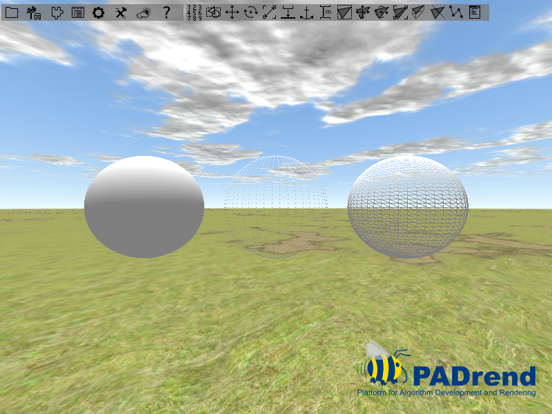

<!------------------------------------------------------------------------------------------------
This work is licensed under the Creative Commons Attribution-ShareAlike 4.0 International License.
 To view a copy of this license, visit http://creativecommons.org/licenses/by-sa/4.0/.
 Author: Florian Pieper (fpieper@mail.uni-paderborn.de)
 PADrend Version 1.0.0
------------------------------------------------------------------------------------------------->
<!---BEGINN_INDEXSECTION--->
<!---Automaticly generated section. Do not edit!!!--->
# Overview
* 3.1.5.2 Node States
    * 3.1.5.2.1 [Introduction to States](../../../../../3_Development_Guide/1_EScript/5_MinSG/2_Node_States/1_Introduction_to_States.html)
    * 3.1.5.2.2 [AlphaTestState](../../../../../3_Development_Guide/1_EScript/5_MinSG/2_Node_States/2_Alpha_Test_State/AlphaTestState.html)
    * 3.1.5.2.3 [BlendingState](../../../../../3_Development_Guide/1_EScript/5_MinSG/2_Node_States/3_Blending_State/BlendingState.html)
    * 3.1.5.2.4 [CullFaceState](../../../../../3_Development_Guide/1_EScript/5_MinSG/2_Node_States/4_Cull_Face_State/CullFaceState.html)
    * 3.1.5.2.5 [GroupState](../../../../../3_Development_Guide/1_EScript/5_MinSG/2_Node_States/5_Group_State/GroupState.html)
    * 3.1.5.2.6 [LightingState](../../../../../3_Development_Guide/1_EScript/5_MinSG/2_Node_States/6_Lighting_State/LightingState.html)
    * 3.1.5.2.7 [MaterialState](../../../../../3_Development_Guide/1_EScript/5_MinSG/2_Node_States/7_Material_State/MaterialState.html)
    * 3.1.5.2.8 [NodeRendererState](../../../../../3_Development_Guide/1_EScript/5_MinSG/2_Node_States/8_Node_Renderer_State/NodeRendererState.html)
    * 3.1.5.2.9 [PolygonModeState](../../../../../3_Development_Guide/1_EScript/5_MinSG/2_Node_States/9_Polygon_Mode_State/PolygonModeState.html)
    * 3.1.5.2.10 [ScriptedStates](../../../../../3_Development_Guide/1_EScript/5_MinSG/2_Node_States/10_Scripted_State/ScriptedStates.html)
    * 3.1.5.2.11 [ShaderState](../../../../../3_Development_Guide/1_EScript/5_MinSG/2_Node_States/11_Shader_State/ShaderState.html)
    * 3.1.5.2.12 [ShaderUniformState](../../../../../3_Development_Guide/1_EScript/5_MinSG/2_Node_States/12_Shader_Uniform_State/ShaderUniformState.html)
    * 3.1.5.2.13 [Texturing](../../../../../3_Development_Guide/1_EScript/5_MinSG/2_Node_States/13_Texturing_State/Texturing.html)
    * 3.1.5.2.14 [TransparencyRenderer](../../../../../3_Development_Guide/1_EScript/5_MinSG/2_Node_States/14_TransparencyRenderer/TransparencyRenderer.html)
<!---END_INDEXSECTION--->

# Goal of this tutorial
This tutorial shows an example usage of polygon mode states.

# Polygon modes
With polygon modes you can change the way a mesh is rendered.
One way of applying polygon modes to a node is using a _MinSG.PolygonModeState_.
There are three modes that can be set in the state:
* FILL: the mesh is rendered with a solid surface.
* LINE: only the outlines of the meshes polygons are rendered.
* POINT: only the meshes vertices are rendered as dots.

# Creating the scene
The scene is build from three spheres, which are positioned on the x-y-plane beside each other.
Each sphere have a _PolygonModeState_ attached to it, so that you can observe the effect of the different modes.  
For each sphere a _GeometryNode_ is instantiated.
After that the nodes are moved so that they do not overlap.

<!---INCLUDE src=PolygonModeState.escript, start=14, end=24--->
<!---BEGINN_CODESECTION--->
<!---Automaticly generated section. Do not edit!!!--->
    //create a sphere mesh
    var mesh = Rendering.MeshBuilder.createSphere(50, 50);
    
    //create three geometry nodes including the mesh
    var node1 = new MinSG.GeometryNode(mesh);
    var node2 = new MinSG.GeometryNode(mesh);
    var node3 = new MinSG.GeometryNode(mesh);
    
    //move two nodes so that they are seperated
    node1.moveLocal(new Geometry.Vec3(-2.5, 0, 0));
    node3.moveLocal(new Geometry.Vec3(2.5, 0, 0));
<!---END_CODESECTION--->

Next up we create the three node states.
There are two ways to set the mode of a state.
First of all you can call _setMode_ on the state and pass a mode to it.

<!---INCLUDE src=PolygonModeState.escript, start=26, end=31--->
<!---BEGINN_CODESECTION--->
<!---Automaticly generated section. Do not edit!!!--->
    //create three polygone mode states with different modes
    var fillState = new MinSG.PolygonModeState();
    fillState.setMode(Rendering.PolygonModeParameters.FILL);
    
    var pointState = new MinSG.PolygonModeState();
    pointState.setMode(Rendering.PolygonModeParameters.POINT);
<!---END_CODESECTION--->

For the second way you need to instantiate a _Rendering.PolygonModeParameters_ object.
You can than use _setMode_ on the parameter to set the mode.
After that the parameter is added to the state by calling _setParameters_.

<!---INCLUDE src=PolygonModeState.escript, start=33, end=36--->
<!---BEGINN_CODESECTION--->
<!---Automaticly generated section. Do not edit!!!--->
    var lineState = new MinSG.PolygonModeState();
    var parameter = new Rendering.PolygonModeParameters();
    parameter.setMode(Rendering.PolygonModeParameters.LINE);
    lineState.setParameters(parameter);
<!---END_CODESECTION--->

Next up we attach the states to our nodes.

<!---INCLUDE src=PolygonModeState.escript, start=38, end=41--->
<!---BEGINN_CODESECTION--->
<!---Automaticly generated section. Do not edit!!!--->
    //add the states to the nodes
    node1.addState(fillState);
    node2.addState(pointState);
    node3.addState(lineState);
<!---END_CODESECTION--->

In a last step a scene graph is build and register to PADrend.
The different polygon modes can be seen in the image below.

