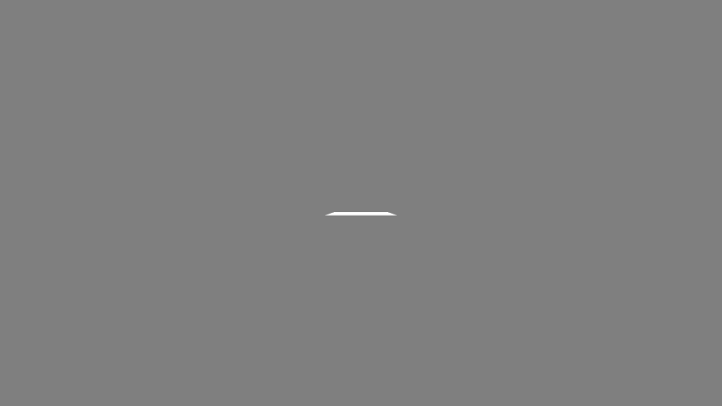
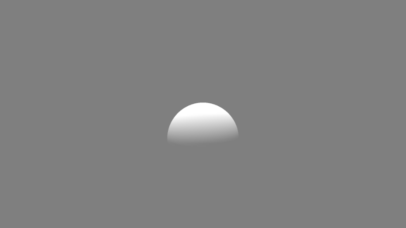
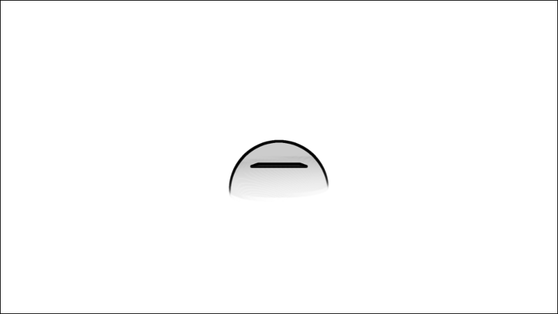

<!------------------------------------------------------------------------------------------------
This work is licensed under the Creative Commons Attribution-ShareAlike 4.0 International License.
 To view a copy of this license, visit http://creativecommons.org/licenses/by-sa/4.0/.
 Author: Florian Pieper (fpieper@mail.uni-paderborn.de)
 PADrend Version 1.0.0
------------------------------------------------------------------------------------------------->
<!---BEGINN_INDEXSECTION--->
<!---Automaticly generated section. Do not edit!!!--->
# Overview
* 3.1.5.5 Evaluation
    * 3.1.5.5.1 [Image Compare](../../../../../3_Development_Guide/1_EScript/5_MinSG/5_Evaluation/1_Image_Compare/Image_Compare.html)
    * 3.1.5.5.2 [Frame Time Measurement](../../../../../3_Development_Guide/1_EScript/5_MinSG/5_Evaluation/2_Frame_Time_Measurement/Frame_Time_Measurement.html)
<!---END_INDEXSECTION--->

# Image Compare
This tutorial is about evaluating the image quality.
The image quality is measured by comparing two images.
This provides you with the possibility to compare an approximated geometry with the original one.
In this way you can evaluate the difference between approximation compared to the original.

## In this tutorial
In this tutorial you should learn how to use the image evaluator.

## Code walkthrough
Okay lets dig right into it and have a look at the code.

### Loading modules
Before we can start the measuring we need to load some modules.
There are basically three modules needed.
First of all we need the waypoint module to set up a camera path.
Next up we need the image evaluator module for the measurement itself.
And last but not least we need the data table module to save our results.

<!---INCLUDE src=ImageCompare.escript, start=14, end=17--->
<!---BEGINN_CODESECTION--->
<!---Automaticly generated section. Do not edit!!!--->
    //loading modules
    static PathManagement = Std.module('Waypoints/PathManagement');
    static ImageCompareEvaluator = Std.module('ImageCompare/ImageCompareEvaluator');
    static DataTable = Std.module('LibUtilExt/DataTable');
<!---END_CODESECTION--->

### Setting up the scenes
The first thing we need are two scenes that should be compared.
For simplicity, both scenes contain a single object.
The first scene holds a box, while the second one holds a cube.
In this way both scenes are different from each other, so that we should see some differences in the evaluation.
Creating the scenes and register them to PADrend is done in the way we are used to.
However, since we deal with two scenes, we have to do it twice.

<!---INCLUDE src=ImageCompare.escript, start=27, end=43--->
<!---BEGINN_CODESECTION--->
<!---Automaticly generated section. Do not edit!!!--->
    //creating two scenes
    var mesh1 = Rendering.MeshBuilder.createBox(new Geometry.Box(0, 0, -2, 1, 1, 1));
    var mesh2 = Rendering.MeshBuilder.createSphere(50, 50);
    
    var scene_1 = new MinSG.ListNode();
    var geoNode = new MinSG.GeometryNode(mesh1);
    scene_1 += geoNode;
    
    var scene_2 = new MinSG.ListNode();
    geoNode = new MinSG.GeometryNode(mesh2);
    geoNode.moveLocal(new Geometry.Vec3(0, 0, -2));
    scene_2 += geoNode;
    
    PADrend.registerScene(scene_1);
    PADrend.selectScene(scene_1);
    PADrend.registerScene(scene_2);
    PADrend.selectScene(scene_1);
<!---END_CODESECTION--->

### Setting up a camera path
Next up we set up a camera path so that the images we take while we are measuring differ from each other.
Therefore we first create a path and than add two waypoints to it.
For each waypoint we need a transformation for the camera.
In the first waypoint we use the cameras original transformation.
For the second one we rotate the camera 45°.
We supply each waypoint with a timestamp.

<!---INCLUDE src=ImageCompare.escript, start=45, end=54--->
<!---BEGINN_CODESECTION--->
<!---Automaticly generated section. Do not edit!!!--->
    //setting up the camera path
    var path = PathManagement.createPath();
    path.createWaypoint(PADrend.getActiveCamera().getWorldTransformationSRT(), 0);
    
    var transform = PADrend.getActiveCamera().getWorldTransformationSRT();
    var translation = transform.getTranslation();
    transform.translateLocal(translation);
    transform.rotateLocal_deg(45.0, new Geometry.Vec3(0,1,0));
    transform.translateLocal(-translation);
    path.createWaypoint(transform, 1);
<!---END_CODESECTION--->

### Setting up the measurement
First we need to create an _ImageCompareEvaluator_ object.
This object is generic in a way that it can be used with different comparison functions.
We use the _SSIMComparator_ here, but there are also other ones such as _AverageComparator_, _PyramidComparator_ and _SimilarPixelCounter_.
Next up we tell the evaluator which scenes it should use.
We create a clone of the current camera which we use in the measurement and push the current camera state.
In this way we can go back to the original camera after we are finished.
Next up we need to create an empty list that we can fill up with our results.
The last thing we need to do is to instantiate a progress indicator, which will display the progress of the measurement on the console.
We pass the maximum number of frames to it, as well as its refresh rate.

<!---INCLUDE src=ImageCompare.escript, start=56, end=65--->
<!---BEGINN_CODESECTION--->
<!---Automaticly generated section. Do not edit!!!--->
    //creating and setting up the evaluator
    var evaluator = new ImageCompareEvaluator();
    evaluator.setImageComparator(new MinSG.SSIMComparator());
    evaluator.setScenes(scene_1, scene_2);
    
    //setting up the camera for the measurement
    var measurementCamera = PADrend.getActiveCamera().clone();
    frameContext.pushCamera();
    
    var values = [];
<!---END_CODESECTION--->

The since the comparator uses shaders, we need to tell them were he can find these.
This should be done before instantiating the comparator.
Therefore we set a _FileLocator_ to the folder in which the shaders are contained.
We than attach the file locator the _AbstractOnGpuComparator_ and we are good to go.

<!---INCLUDE src=ImageCompare.escript, start=22, end=25--->
<!---BEGINN_CODESECTION--->
<!---Automaticly generated section. Do not edit!!!--->
    //setting up path of the shaders needed for the comparing
    var fileLocator = new Util.FileLocator();
    fileLocator.addSearchPath("modules/MinSG/data/");
    MinSG.AbstractOnGpuComparator.initShaderFileLocator(fileLocator);
<!---END_CODESECTION--->

### The measurement loop
Since we do not want to evaluate a single frame, but a series of consecutive frames, we run the measurement in a loop.
We run the loop until a maximum number of frames is reached.
The first thing we do in the loop is adapting the camera.
We want to animate the camera path over the number of frames of the measurement.
So we calculate the time with respect to the current frame.
Next up we set the transformation of the camera to the current position of the path and activate the camera for rendering.   
Lets start the actual measurement.
We start it by calling _beginMeausre()_.
Than we call _measure()_ and pass the frame context, the root node of the current scene and the current viewport to it.
After that we end the measurement and collect the results.
We add the result of the current measurement to the result list.
In the end we will store this list to disk.
During the measurement the evaluator stores three textures.
The first two are the both images that are compared to each other.
You can access them by calling _getFirstTexture_ and _getSecondTexture_ on the evaluator.
The third texture denotes the image difference found by the evaluator.
You can access it by calling _getResultTexture_.
We draw this texture to the screen and tell PADrend to swap buffers so that it gets displayed.
In a last step we tell our progress indicator to increment.
It will display the progress of the overall measurement on the console to give you an idea how long the measurement is still going to take.

<!---INCLUDE src=ImageCompare.escript, start=22, end=25--->
<!---BEGINN_CODESECTION--->
<!---Automaticly generated section. Do not edit!!!--->
    //setting up path of the shaders needed for the comparing
    var fileLocator = new Util.FileLocator();
    fileLocator.addSearchPath("modules/MinSG/data/");
    MinSG.AbstractOnGpuComparator.initShaderFileLocator(fileLocator);
<!---END_CODESECTION--->

### Store results to disk
We will store the results as CSV file.
So it can be processed by tools like Excel.
Therefore we create a _DataTable_ that contains of two columns.
We apply the name of the first row by passing it in the constructor call.
Than we add another column and add our values to it.
Next up we store the data table to a file.

<!---INCLUDE src=ImageCompare.escript, start=93, end=96--->
<!---BEGINN_CODESECTION--->
<!---Automaticly generated section. Do not edit!!!--->
    
    //write results to file
    var dataTable = new DataTable("frame");
    dataTable.addDataRow("quality","",values);
<!---END_CODESECTION--->

### Results
The CSV file will contain a number for each frame.
This number indicates the image similarity with respect to the used measurement in percentage.  
The images below show the result of the comparison.
The first two images show the two scenes, the third is the difference image.

