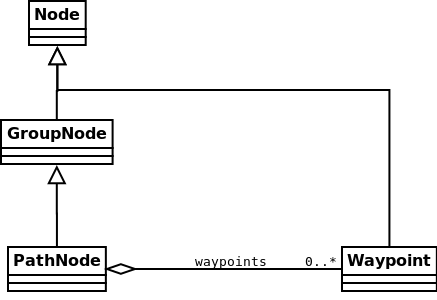

<!------------------------------------------------------------------------------------------------
This work is licensed under the Creative Commons Attribution-ShareAlike 4.0 International License.
 To view a copy of this license, visit http://creativecommons.org/licenses/by-sa/4.0/.
 Author: Florian Pieper (fpieper@mail.uni-paderborn.de)
 PADrend Version 1.0.0
------------------------------------------------------------------------------------------------->

In a previous tutorial we discussed how to create a camera path by using the user interface.
You should read the tutorial first, since it is a good starting point to get in touch with camera paths.  
This tutorial is about creating camera paths by using EScript.

## Class hierarchy



The image above shows the class hierarchy of all classes involved in camera paths.
There are mainly two classes which are important.
The class _Waypoint_ describes a single way point in the camera path.
It holds a SRT matrix to describes the way points description as well as a time stamp.
The second class is _PathNode_, which contains a list of way points to create a camera path.
The class holds methods to create and manipulate its way points.
Since it inherits from _Node_ we can add it to the scene graph.  
Even so we could use _PathNode_ to create a camera path, we will not do this here.
In the plugins folder of PADrend you can find the plugin that we used in the previous camera path tutorial.
It comes with a script called _PathManagement_.
The script handles all the methods you find in _PathNode_.
In addition it offers methods that make the handling of camera paths more easy.
For each function of the UI-version there is a method.

## Creating a camera path
Before we can create a path we first have to load the _PathManagement_ module.

<!---INCLUDE src=CameraPath.escript, start=14, end=14--->
<!---BEGINN_CODESECTION--->
<!---Automaticly generated section. Do not edit!!!--->
```js
static PM = Std.module('Waypoints/PathManagement');
```
<!---END_CODESECTION--->

In the end we want to store the camera path to disk and we also want to try to load it from disk.
Therefore we need to have some file path.

 <!---INCLUDE src=CameraPath.escript, start=15, end=15--->
<!---BEGINN_CODESECTION--->
<!---Automaticly generated section. Do not edit!!!--->
```js
static pathFile = __DIR__ + "/test.path";
```
<!---END_CODESECTION--->

 Next up we create a scene.
 You should be familiar with this.

 <!---INCLUDE src=CameraPath.escript, start=17, end=23--->
<!---BEGINN_CODESECTION--->
<!---Automaticly generated section. Do not edit!!!--->
```js
var scene = new MinSG.ListNode();
var mesh = Rendering.MeshBuilder.createBox(new Geometry.Box(2, 0, -4, 1, 1, 1));
var node = new MinSG.GeometryNode(mesh);
scene += node;

PADrend.registerScene(scene);
PADrend.selectScene(scene);
```
<!---END_CODESECTION--->

 So much for the preparation.
 Lets get started.

 <!---INCLUDE src=CameraPath.escript, start=25, end=55--->
<!---BEGINN_CODESECTION--->
<!---Automaticly generated section. Do not edit!!!--->
```js
var pathNode = void;

if(IO.isFile(pathFile)){
    outln("Loading path from file...");
    pathNode = PM.loadPath(pathFile);
    scene += pathNode;
}
else{
    outln("Creating path...");
    pathNode = PM.createPath(scene);
    PM.activatePath(pathNode);
    
    PADrend.getActiveCamera().getWorldTransformationSRT().translateLocal(new Geometry.Vec3(0, 1 ,0));
    
    PM.createWaypointAtCam(0);
    
    var transform = PADrend.getActiveCamera().getWorldTransformationSRT();
    transform.translateLocal(new Geometry.Vec3(0, 0 ,-10.0));
    transform.rotateLocal_deg(-90.0, new Geometry.Vec3(0,1,0));
    
    PM.createWaypoint(transform, 3);
    
    transform.translateLocal(new Geometry.Vec3(0, 0 ,-10.0));
    transform.rotateLocal_deg(-135.0, new Geometry.Vec3(0,1,0));
    
    PM.createWaypoint(transform, 6);
    
    PM.closeLoop();
    
    PM.setTimecodesByDistance(pathNode, 3);
}
```
<!---END_CODESECTION--->

 We only want to create the path if we can not find it on disk.
 So first of all we use _IO.isFile_ to check if the file exists.
 If it exists we use _loadPath_ to load it.
 The methods takes a file path and returns a path node loaded from the file.
 We than attach the path node to our scene.   
 In case we could not find the file, we need to create the camera path.
 Therefore we first call _createPath_.
 We pass our scene node to it.
 This is optional, as you can also go with an empty parameter set.
 If you pass the scene node, the created path node gets automatically attached to the scene.
 The method returns the created node.
 Next up we translate the camera to the start position of our path and create a way point at that position by calling _createWaypointAtCam_.
 We pass 0 as time stamp to it.  
 For the next way point we extract the cameras transformation matrix and manipulate it by a translation and a rotation.
 We use _createWaypoint_ and pass the matrix as well as a time stamp to it.
 Note that the timestamps for both methods are optional.
 Next up we create another way point in the same manner.   
 We use _closeLoop_ to create a last way point to go back to the start of the path.
 That is it.
 We have created all of our way points.
 However the time stamp for the last way point is dependent on previous way point.
 The time stamp is way to low to allow a constant animation.
 We can adapt it by calling _setTimecodesByDistance_.
 We pass the path node to it as well as the value 3.
 This scales the timestamps to be 1/3 of the distance between two consecutive way points.  
 Now that we have our path set up, lets show it and start an animation.
 _PathManagement_ supports us with that.
 We simply call the two functions _showPath_ and _animation_active_ and pass _true_ to them.
 Last but not least we store the path to disk.

  <!---INCLUDE src=CameraPath.escript, start=57, end=61--->
<!---BEGINN_CODESECTION--->
<!---Automaticly generated section. Do not edit!!!--->
```js
PM.showPath(true);

PM.animation_active(true);

PM.savePath(pathFile);
```
<!---END_CODESECTION--->
