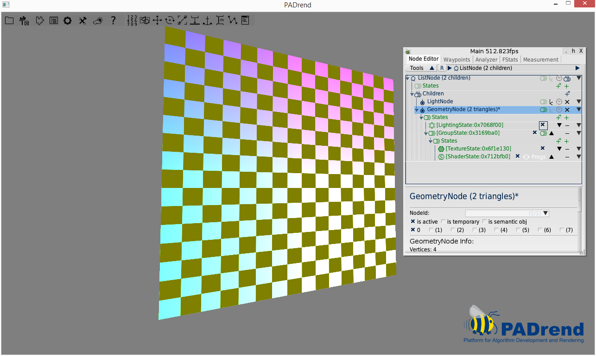
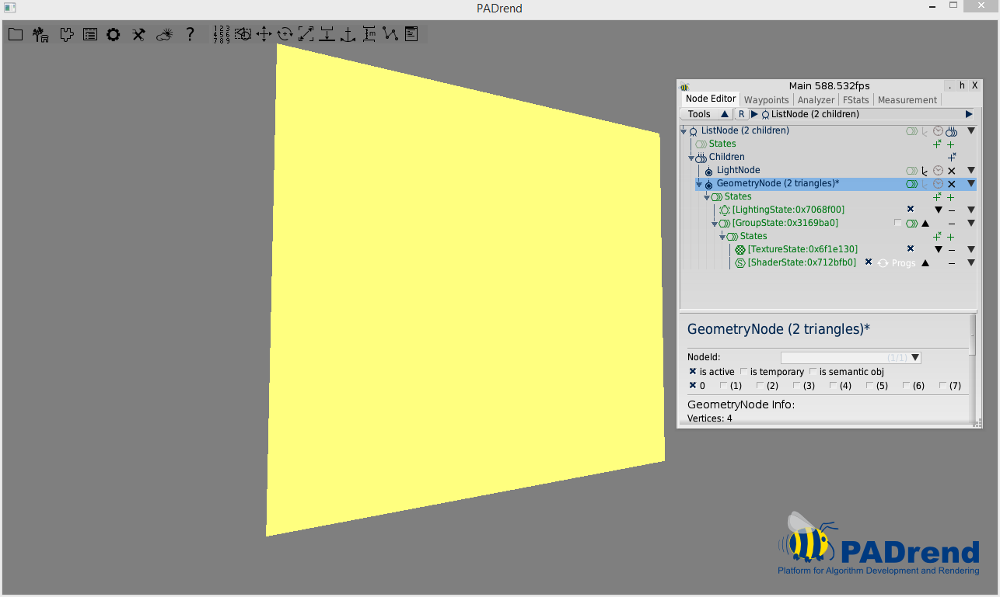
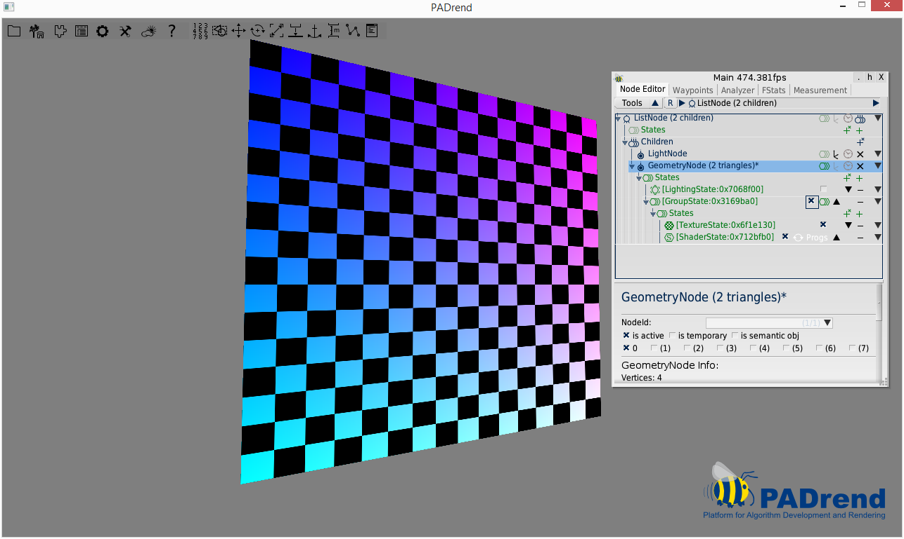

<!------------------------------------------------------------------------------------------------
This work is licensed under the Creative Commons Attribution-ShareAlike 4.0 International License.
 To view a copy of this license, visit http://creativecommons.org/licenses/by-sa/4.0/.
 Author: Stanislaw Eppinger (eppinger@mail.uni-paderborn.de)
 PADrend Version 1.0.0
------------------------------------------------------------------------------------------------->


# GroupState
The GroupState is a rather simple state. As the name already indicates this state groups other states. You can create multiple states and either put them in the GroupState which then is attached to a node or you can just simply attach every state one by one to the node. The effect will be the same.  
One possible purpose for GroupState is when you want group states into a logical unit which e.g. computes a particular effect. It is now possible to de-/activate the effect by just de-/activating the GroupState. Without the GroupState you would need to de-/activate every particular state one by one. The following example will illustrate this scenario.

## Simple Example
This example will be a combination of the examples in the LightingState and ShaderState tutorials. We will create a simple quad with a chessboard texture on it and place a point light in front of it. A shader will multiply each fragment's color value on the texture by the corresponding uv coordinate and add the point light's ambient value. The texture and shader state will be grouped whereas the light state will not. Both states (the group and light state) are attached to the geometry node. When all states are active the result will look like this:



We will not go over the creation of the quad, the shader state and the lighting state. If you want to know more about that you should take a look at the LightingState and ShaderState tutorial. We will go over the important changes.

First of all we will change the fragment shader to include the point light in the lighting computation.

<!---INCLUDE src=Groupstate.escript, start=64, end=86--->
<!---BEGINN_CODESECTION--->
<!---Automaticly generated section. Do not edit!!!--->
```js
struct sg_LightSourceParameters {
    int type; 							// has to be DIRECTIONAL, POINT or SPOT
    vec3 position; 						// position of the light  ????????????????????????????????
    vec3 direction; 					// direction of the light, has to be normalized ????????????????????????????????
    vec4 ambient, diffuse, specular;	// light colors for all lights
    float constant, linear, quadratic;	// attenuations for point & spot lights
    float exponent, cosCutoff;			// spot light parameters
};

uniform sampler2D chessTexture;
uniform sg_LightSourceParameters	sg_LightSource[8];
uniform int							sg_lightCount;

void main(void) {
    vec2 uv = gl_TexCoord[0].st;
    vec4 result = texture2D(chessTexture, uv);
    result.r *= uv.s;
    result.g *= uv.t;
    if(sg_lightCount > 1) {
        result += sg_LightSource[1].ambient;
    }
    gl_FragColor = result;
}
```
<!---END_CODESECTION--->

Light sources are passed in the form of the `sg_LightSourceParameters` struct. The uniform array `sg_LightSource` contains all of them and the uniform variable `sg_lightCount` tells us how many of them are in the shader. After declaring those struct and uniforms the only change we have made is at this line:

<!---INCLUDE src=Groupstate.escript, start=82, end=84--->
<!---BEGINN_CODESECTION--->
<!---Automaticly generated section. Do not edit!!!--->
```js
if(sg_lightCount > 1) {
    result += sg_LightSource[1].ambient;
}
```
<!---END_CODESECTION--->

We check if there are more than one light source and if it is the case, we take the point light's ambient value and add it to the final result. "Why more than two? We only have one point light?", you might probably ask. By default there is always the sun in our scene. Adding a new light source, just as we did with the point light, will result in two light sources in total in the scene. Thus the point light will be at the second index in the `sg_LightSource` array in our shader.

<!---INCLUDE src=Groupstate.escript, start=106, end=111--->
<!---BEGINN_CODESECTION--->
<!---Automaticly generated section. Do not edit!!!--->
```js
// add group state to node
var groupState = new MinSG.GroupState();
groupState.addState(textureState);
groupState.addState(shaderState);
geo += groupState;
geo += lightingState;
```
<!---END_CODESECTION--->

This code creates a group state, then the texture and shader state are added to the group. Afterwards the group state and the lighting state are added to the geometry node. In this way we can deactivate the shader and texture by just deactivating the group state. If you do so, then the quad will look like this:



We see, that the texture and the shader effect is gone by just deactivating one state. We can also deactivate the lighting state and see that the light source is not illuminating the quad anymore:




