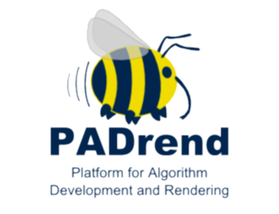
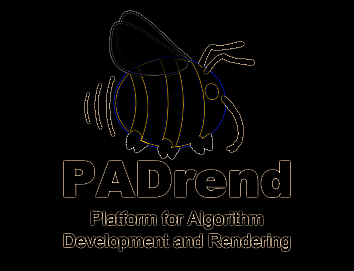

<!------------------------------------------------------------------------------------------------
This work is licensed under the Creative Commons Attribution-ShareAlike 4.0 International License.
 To view a copy of this license, visit http://creativecommons.org/licenses/by-sa/4.0/.
 Author: Henrik Heine (hheine@mail.uni-paderborn.de)
 PADrend Version 1.0.0
------------------------------------------------------------------------------------------------->

A `TextureProcessor` converts some input textures into some output textures using a shader. It is just a wrapper for some simple `FBO` handling, but can simplify your code. The basic idea is that you only specify the input/output textures and the shader. The `TextureProcessor` will then take care of the rest.

This class is implemented as a module: `LibRenderingExt/TextureProcessor`

So in order to use it, it might be a good idea to place the following line onto the start of your EScript file:
```
static TextureProcessor = Std.module('LibRenderingExt/TextureProcessor');
```

The basic usage is as follows:
```
(new TextureProcessor)
  .setInputTextures([myInputA,myInputB])
  .setOutputTexture( myColorTexture )
  .setOutputDepthTexture( myDepthTexture )
  .setShader(myShader)
  .execute();
```
Here we just create an instance of the `TextureProcessor`, set some settings and finally call execute. Now a simple quad is rendered using the given shader and textures. The resulting color texture is rendered onto the `myColorTexture` and the depth texture onto `myDepthTexture`. The depth texture and the input textures are optional, but you must specify at least one output texture and one shader.

## Advanced usage
If you want to render not only a fullscreen quad, but more complex things, you could do so by using `begin` and `end` instead of only `execute`.
```

var tp = (new TextureProcessor)
  .setInputTextures([myInputA,myInputB])
  .setOutputTexture( myColorTexture )
  .setOutputDepthTexture( myDepthTexture );
tp.begin();
// render something, like a complete mesh
tp.end();
```

## Creating textures
There are several different ways to obtain a texture. Input textures are often loaded from file, therefore you would probably want to use this:
```
var myInput = Rendering.createTextureFromFile(file);
```
You could also create textures by using some other PADrend functions. The `alpha` parameter that is used by some functions, determines whether the texture should have an alpha channel or not. The `width` and `height` parameters are of course used to define the width and height of the texture in pixels.
* `Rendering.createRedTexture(Number width, Number height)`
 * create a completely red texture of the given size
* `Rendering.createChessTexture(Number width, Number height, Number tileSize)`
 * create a chess pattern with tiles of the size tileSize*tileSize
* `Rendering.createDepthTexture(Number width, Number height)`
  * creates a depth texture of the given size
* `Rendering.createHDRTexture(Number width, Number height, Bool alpha)`
 * creates an HDR texture of the given size. Each channel of an HDR texture is a real 32 floating point value.
* `Rendering.createStdTexture(Number width, Number height, Bool alpha)`
 * creates an ordinary texture of the given size. Each channel is used like a floating point value in the range [0, 1]. Of course each channel only stores an 8 bit value.
* `Rendering.createTextureFromBitmap(Util.Bitmap bmp, Bool clampToEdges = false)`
 * creates a texture from the given bitmap. If `clampToEdges` is true, the wrap mode of this texture is set to `clamp`. Of course you could also create a bitmap from a texture:
 * `createBitmapFromTexture(RenderingContext, Texture)`
* `Rendering.createNoiseTexture(Number width, Number height, Bool alpha, Number scaling = 1.0)`
 * creates a noise texture using Perlin Noise
* `Rendering.createTextureFromScreen([Rect screenRect, bool alpha = true] |  bool alpha = true)`
 * creates texture from a screenshot

## Example
This example will use the `execute` function to simply render a quad using the given shader. Therefore the vertex shader is only forwarding the position and texture coordinates:

<!---INCLUDE src=TextureProcessorExample.escript, start=20, end=24--->
<!---BEGINN_CODESECTION--->
<!---Automaticly generated section. Do not edit!!!--->
```js
var vertexShaderCode = "
void main(void){
    gl_TexCoord[0] = gl_MultiTexCoord0;
    gl_Position = ftransform();
}";
```
<!---END_CODESECTION--->

The fragment shader is of course more complex and depends on your goal. In this simple example we just modify the given input texture:

<!---INCLUDE src=TextureProcessorExample.escript, start=26, end=35--->
<!---BEGINN_CODESECTION--->
<!---Automaticly generated section. Do not edit!!!--->
```js
var fragmentShaderCode = "
#version 120
uniform sampler2D uTexture;
void main(void) {
    vec2 uv = gl_TexCoord[0].st;
    vec4 color = texture2D(uTexture, uv);
    color.rgb = 1 - abs(2 * color.rgb - 1);
    gl_FragColor = color;
}
";
```
<!---END_CODESECTION--->

Now we can create the corresponding shader and textures:

<!---INCLUDE src=TextureProcessorExample.escript, start=36, end=41--->
<!---BEGINN_CODESECTION--->
<!---Automaticly generated section. Do not edit!!!--->
```js
// create shader
var shader = Rendering.Shader.createShader(vertexShaderCode, fragmentShaderCode);

// create input and output textures
var input = Rendering.createNoiseTexture(256, 256, false, 0.01);
var output = Rendering.createStdTexture(256, 256, true);
```
<!---END_CODESECTION--->

Afterwards we just execute the `TextureProcessor` and save the result:

<!---INCLUDE src=TextureProcessorExample.escript, start=43, end=51--->
<!---BEGINN_CODESECTION--->
<!---Automaticly generated section. Do not edit!!!--->
```js
// create and execute TextureProcessor
(new TextureProcessor)
    .setInputTextures([input])
    .setOutputTexture(output)
    .setShader(shader)
    .execute();

// just save the result to the filesystem
Rendering.saveTexture(renderingContext, output, "presets/output.png");
```
<!---END_CODESECTION--->

The input texture is a noise texture and looks like the left image. Our shader will now convert this input texture to the right image:


The complete code can be found here: [TextureProcessorExample.escript](TextureProcessorExample.escript)

## Blur example
Blurring a picture might be useful, therefore this section will show a simple blurring example.
The vertex shader is still the same, but the fragment shader is now a bit more complex:

<!---INCLUDE src=Blur.escript, start=24, end=64--->
<!---BEGINN_CODESECTION--->
<!---Automaticly generated section. Do not edit!!!--->
```js
var fragmentShaderCode = "
// 3 * 3 Kernel
#define KERNEL_SIZE 9

// input texture
uniform sampler2D uImage;
// dimensions of input
uniform float uWidth;
uniform float uHeight;

// used to convert from bitmap space [0..size-1] to texture space [0..1]
const float step_w = 1.0/uWidth;
const float step_h = 1.0/uHeight;

// Gaussian kernel
// 1 2 1
// 2 4 2
// 1 2 1	
// sum = 16
const float kernel[KERNEL_SIZE] = { 
    1.0/16.0, 2.0/16.0, 1.0/16.0,
    2.0/16.0, 4.0/16.0, 2.0/16.0,
    1.0/16.0, 2.0/16.0, 1.0/16.0 
};

const vec2 offset[KERNEL_SIZE] = { 
    vec2(-step_w, -step_h), vec2(0.0, -step_h), vec2(step_w, -step_h), 
    vec2(-step_w, 0.0), vec2(0.0, 0.0), vec2(step_w, 0.0), 
    vec2(-step_w, step_h), vec2(0.0, step_h), vec2(step_w, step_h) 
};

void main(void) {
    vec2 uv = gl_TexCoord[0].st;
    vec4 sum = vec4(0.0);
    for(int i = 0; i < KERNEL_SIZE; i++) {
        vec4 tmp = texture2D(uImage, uv + offset[i]);
        sum += tmp * kernel[i];
    }
    gl_FragColor = sum;
}
";
```
<!---END_CODESECTION--->

This is a simple convolution filter. We define a 3*3 kernel, which values can be summed up to one. Furthermore we define an offset matrix, which defines the offset for each of the kernel entries. In the main function we then just iterate over the kernel and sum up all values.
With the given kernel we achieve a gaussian blur.

In our EScript code we now have to load a texture and set some shader uniforms:

<!---INCLUDE src=Blur.escript, start=66, end=75--->
<!---BEGINN_CODESECTION--->
<!---Automaticly generated section. Do not edit!!!--->
```js
// create input and output textures
var input = Rendering.createTextureFromFile("presets/PADrendIcon.png");
static width = input.getWidth();
static height = input.getHeight();
var output = Rendering.createStdTexture(width, height, true);

// create shader
var shader = Rendering.Shader.createShader(vertexShaderCode, fragmentShaderCode);
shader.setUniform(renderingContext, new Rendering.Uniform('uWidth', Rendering.Uniform.FLOAT, [width]), false);
shader.setUniform(renderingContext, new Rendering.Uniform('uHeight', Rendering.Uniform.FLOAT, [height]), false);
```
<!---END_CODESECTION--->

Afterwards we can just execute the TextureProcessor and save the result. The complete code can be found in [Blur.escript](Blur.escript)

The following images show the input and output:




### Edge detection
This convolution filter could be also used for edge detection. To do so, we just have to change the kernel to this:
```
const float kernel[KERNEL_SIZE] = {
	-1.0/16.0, -1.0/16.0, -1.0/16.0,
	-1.0/16.0, 8.0/16.0, -1.0/16.0,
	-1.0/16.0, -1.0/16.0, -1.0/16.0
};
```
Depending on your image, you may need to light it up:
```
// just before gl_FragColor = sum;
sum *= 4;
```
And now you get:





