<!------------------------------------------------------------------------------------------------
This work is licensed under the Creative Commons Attribution-ShareAlike 4.0 International License.
 To view a copy of this license, visit http://creativecommons.org/licenses/by-sa/4.0/.
 Author: Florian Pieper (fpieper@mail.uni-paderborn.de)
 PADrend Version 1.0.0
------------------------------------------------------------------------------------------------->

# Goal of this tutorial
In this tutorial we will put some more work in functional objects.
Functional objects can help to make your work on animations easier.
Also we will add some physics to the scene.

# Assumptions
All previous tutorials are finished.
PADrend is opened and an empty scene is loaded.
Infinite ground and dynamic sky are enabled.
The _ObjectFactories_ plugin is activated.
The toy block library of tutorial 2 is loaded.

# Building the scene
Before we can start with our animations, we first need to build the scene.
The image below shows you how the scene should look like in the end.

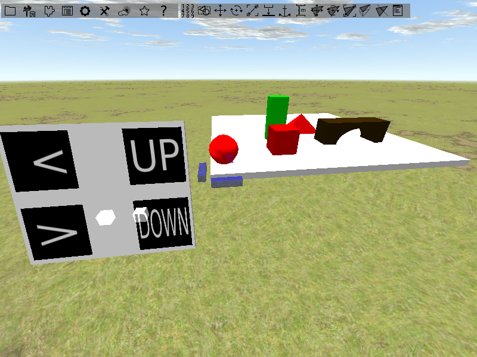

## Adding a ground plate
We start with a ground plate for our scene.
Open the object placer, go to _Basic object factories_ and place a _Geometry/Box_ on the ground.
Give it a name like "GroundPlate".

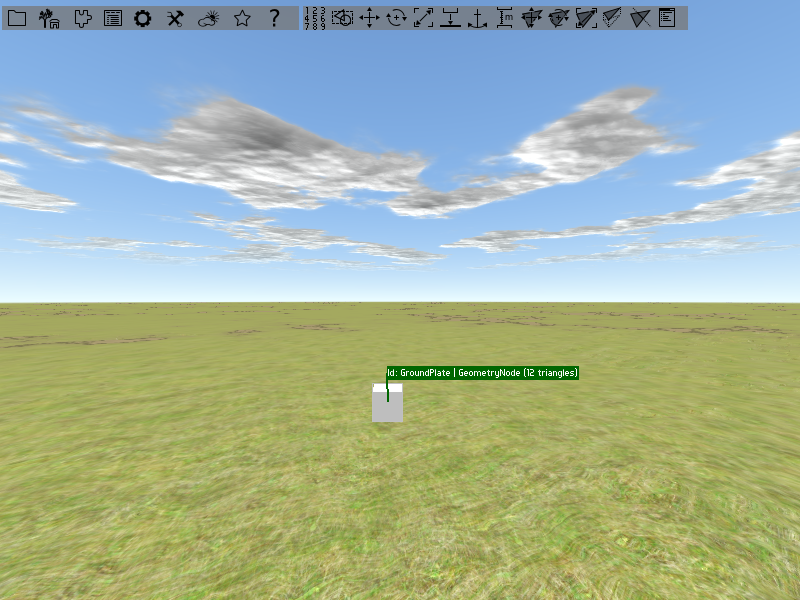

You may have noticed that it is much to small for our purpose.
But as mentioned in tutorial 3, functional objects are predefined objects that are already enriched with object traits.
In case of our box, it has a _Geometry/Box_ trait attached to it.
This object traits allows you to manipulate the size of the box.
Open the ground plate within the object explorer and expand the trait.
You will see three sliders for changing the boxes size in x, y and z direction.
You can also use the text fields besides the sliders to type in values.
Enlarge the box so that it has a size of 10 units in x and y direction.
Leave the size in y direction as it is.

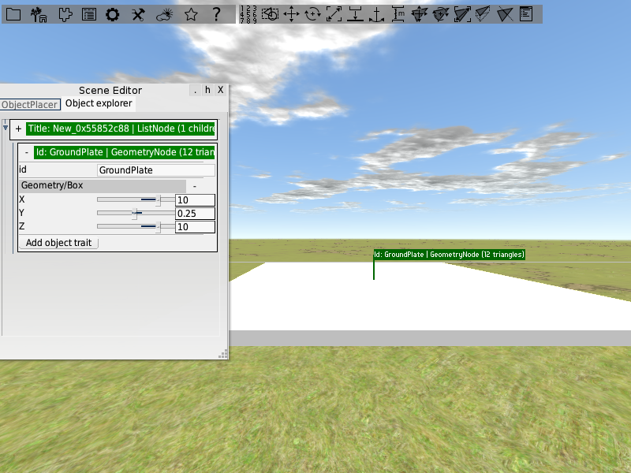

## Adding the animated object
Next up we need a sphere which should be animated in the end.
Go to the object explorer and drag an _Geometry/Sphere_ form _Basic object factories_ into the scene.
Place it in the lower left corner of the ground plate in a way that there is a bit of air between the plate and the sphere.
As the box the sphere also has a trait attached to it.
Here you can change the radius of the sphere as well as the number of segments it is made of.
Increasing the number of segments makes it look rounder.
Change the values if you like to.
Also give the sphere a name like "AnimatedObject".   

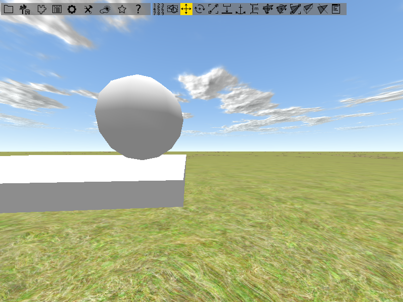

Next up we want to change the color of the sphere.
Select it and open the _Main Window_ by pressing [F1].
To alter the color you need to add a new state to the sphere.
Click on the plus with the x besides _States_ in the upper top of the window to add a new state.
You will see a list of all states that can be added.

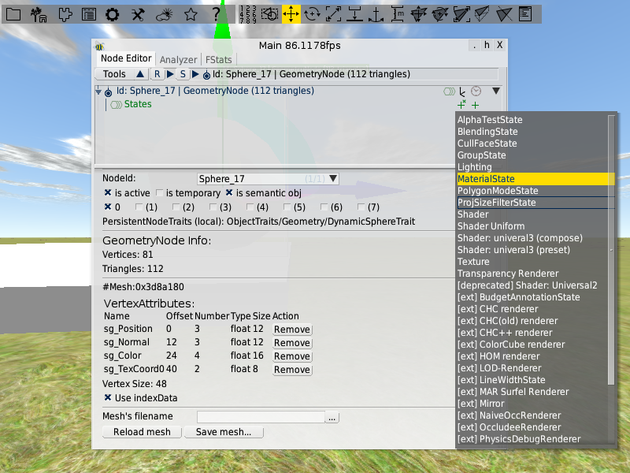

Choose the _MaterialState_ and you will be faced with four groups of sliders for manipulating the spheres material.
The first three groups can be used to set color values for the ambient, specular and defuse part of the material.
In each group there are four sliders for setting the red, green and blue part of the color as well as setting the colors alpha value.
In the last group you can set the shininess of the material.
The sphere should have a red color.
Set for all groups the green and blue values to zero and the red values to one.

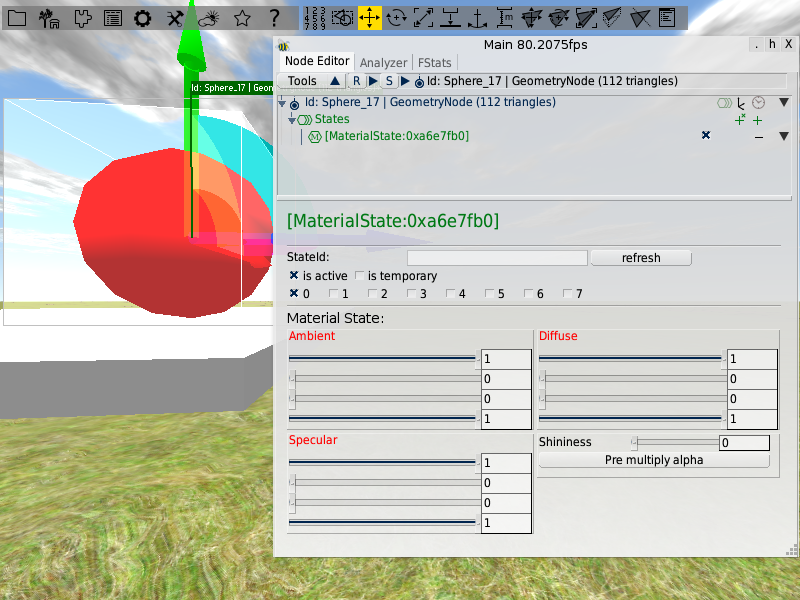

## Building the control panel
Our sphere should be able to move in the xz-plane.
To control the movements, we will build a control panel having buttons for each direction of movement.
The panel is made from a box.
Drag it to the scene, give it a name (e.g. "ControlPanel") and give it a size of 3 x 0.1 x 2.5.
Next up we need some buttons.
Drag a rectangle to the scene (you can also find it under _Basic object factories_  in the object placer) and rotate it by 90 so that it lies flat on the ground.
Give it the name "ButtonLeft".
Open it in the object explorer and add an _Animation/Button_ trait and a _Misc/DynamicTextTexture_ trait to it.
The texture trait allows you to add a text to the button.
Within the field _Text_ of the _Misc/DynamicTextTexture_ trait type in "<".
Add three more buttons to the scene.
Call them "ButtonRight", "ButtonUp" and "ButtonDown".
Arrange them on the control panel like in the image below and set their texts.
You may need to lift them a bit over the control panel since you may faced with display errors otherwise.

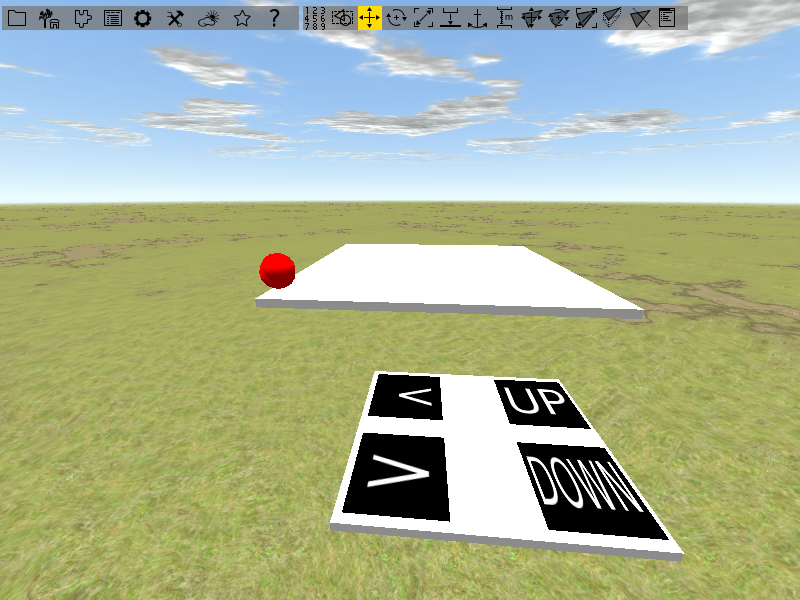

Group the buttons and the control panel together in a common subtree.
Mark the common subtree to be a semantic object.
This will clean up the object explorer.
Next up we will bring the panel in a position that makes it easier to reach the buttons.
Rotate the panel by about 70 degrees around the x axis and place it like in the image below.

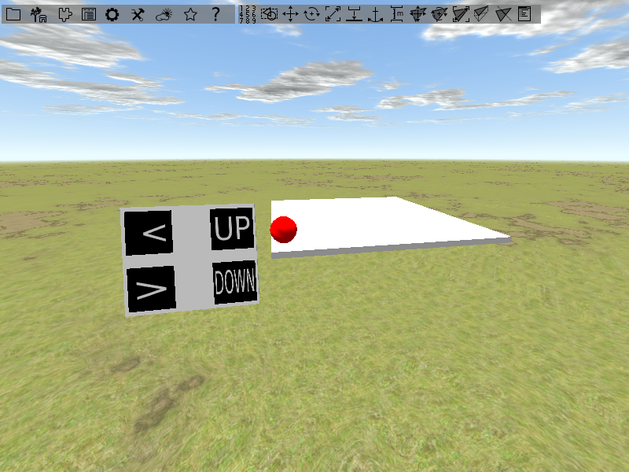

# Creating the animation
For creating the animation we need a key frame animation for each axis.
We can not directly attach both animations to the sphere, since it can only hold one key frame animation trait providing one key frame animation.
But we need each axis separate.
So we need to have two objects for animating the two axis, which transfer their animation to the sphere.
For transferring an animation form one object to another a transformation proxy can be used.
It is provided as an object trait and also there is an predefined object that already has the trait attached to it.
We need three instances of this object.
Two for the axis and the third one to bring both animations together, which than transfers the total animation to the sphere.
We can also skip the third one and directly attach the sphere to the axis animations.
In our case this would be okay, but it can lead to problems if there are more than one object that should receive the animation.

## Transformation proxy for the sphere
Lets first attach an transformation proxy to the sphere.
Open the object placer and drag an instance of _Functional/PositionProxy_ to the scene.
Links are used to connect the proxy to the object which it should transform.
If you have an object selected while you drag the transformation proxy to the scene, it will automatically build a link to that object.
Since the proxy is set to be active by default, transforming it means also transforming the object it is connected to.
So in order to move it around you first need to deactivate by using the _active_ checkbox in its _TransformationProxy_ trait.
Deactivate it and move it next to the sphere.  
Next up we need to build a link to the sphere.
If you already have a link you need probably to change its role.
The _TransformationProxy_ trait offers five link roles:

* _transform_: Apply the proxie's world transformations
* _transformRel_: Apply the proxie's relative transformations
* _transformSnap_: Snap lower center of target's bounding box to proxy's origin(rotation and position)
* _transformSnapOffset_: Preserve the relative transformation between the proxy and the target
* _transformSnapPos_: Snap lower center of target's bounding box to proxy's origin(only position)

Create a link with role _transformSnapOffset_ to the sphere, or update the role of an existing one.
In order to apply the update you need to hit the _Set_ button at the link.
If the transformation proxy has other links attached to it, remove them.
Do not forget to activate the proxy again.

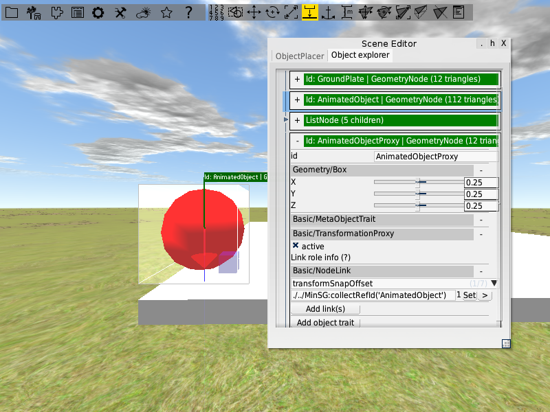

## Adding the two key frame animations
Next up we add two position proxies for the axis.
Drag them into the scene and set their size by their box traits.
The first one should have a length of one unit in x direction, the second one should have a length of one unit in z direction.
Arrange them like in the image below and give them a proper name.

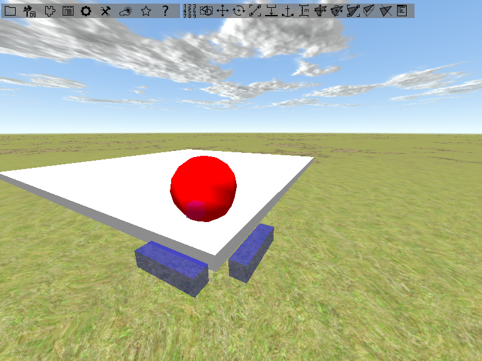

Add a _KeyFrameAnimation_ trait to each of them and set their current position to be the first key frame.
Translate one of the axis along the corresponding side of the ground plate to its end position and add another key frame.
Give the second key frame a time value of ten.
Use the _Apply_ button on the first key frame to transform the axis back to the initial position.
Do the same with the other axis.  
Now we need to connect the axis to the position proxy of the sphere.
Start with one axis.
Add a link with role "transformRel" to it and connect the link to the spheres position proxy.
Do the same thing with the other axis.
If you now apply the different key frames, the sphere should follow the movement.

## Appending a constrained animator
In order to get the animation running we need to attach an animator to it.
In the last tutorial we used a _SimpleMotor_ for the job, which contains of _ContinuesAnimator_ trait.
A continues animator, as the name mentions, runs continuously and produces an increasing time.
In case of our axis we need a animator that runs from a minimum value to a maximum value (or the other way around) and stops there.
For this reason we need a constrained animator.
Since there is no predefined object till now, we need to build one by our selfs.   
Start with a box and give it a name.
Add a _Basic/MetaObjectTrait_ to it.
With help of this trait the object is hidden when you are using a specific rendering layer.
To make an animator out of the box, add a _Animation/ConstrainedAnimatorTrait_ to it.
You may notice that the trait shares some properties with the _ContinuesAnimatorTrait_.
With _min_ and _max_ you can set the start and end value for the animation time.
Our first key frame has a time value of 0 and the second one has a time value of 10.
So you have to set _max_ to 10.
Otherwise the key frame animation would stop after a fraction of the distance it is supposed to translate.
The slider _localTime_ shows the progress of the animation.
With the buttons _min_ and _max_ you can let the animator run once from its minimum time to its maximum time and vise versa.
The button _play_ lets  the animator run form minimum to maximum in a infinite loop.

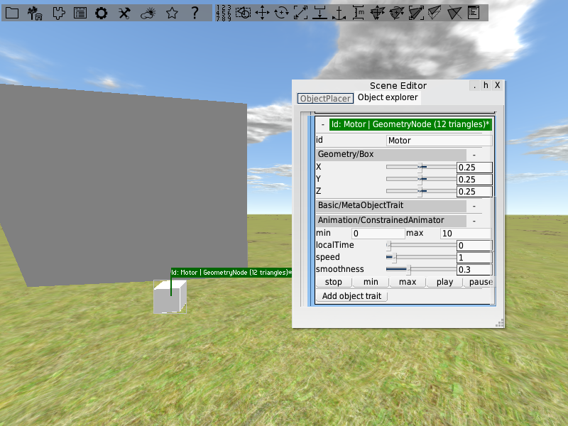

Create a second animator in the same way, so that you end up with one motor for the x-axis and one for the z-axis.
Connect the key frame animations with a link (role _animator_) to the motors (each gets a separate motor).  
The last thing we need to do is connecting our control panel to the motor.
So first create a link from each button to the motors.
Keep in mind to connect the buttons to the correct motors.
The up and down buttons need to be connected to the motor driving the up and down animation.
The left and right buttons need to be connected to the other motor.
Use _switch_ as link role.
Next up we need to alter the functions that should be executed if a button is clicked.
Since we are faced with a constrained animator, we can not use _animationPlay_  anymore.
It would still work but, as described above, it would not have the functionality we need.
Instead we use _animatorGoToMin_ and _animatorGoToMax_.
For the right and the up button set _fn1_ to _animatorGoToMax_.
For the left and the down button set _fn1_ to _animatorGoToMin_.
Do not change _fn2_.
Use the buttons to get the sphere moving.
Check whether the animations are running correctly.

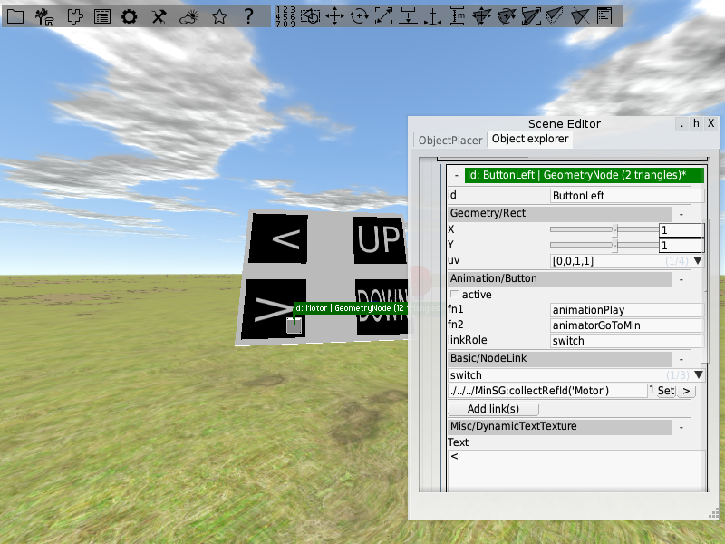

# Adding Physics
With help of physics you can for example make object react on collisions with other objects.
We want to add physics to the scene.
In the end we want to push objects around with the sphere.
To add physics to an object we again use object traits.
First of all you need to activate the physics plugin.
Open the _Config_ menu and go to _Plugins_.
Search the _Physics_ plugin and activate it.
Afterwards restart PADrend.

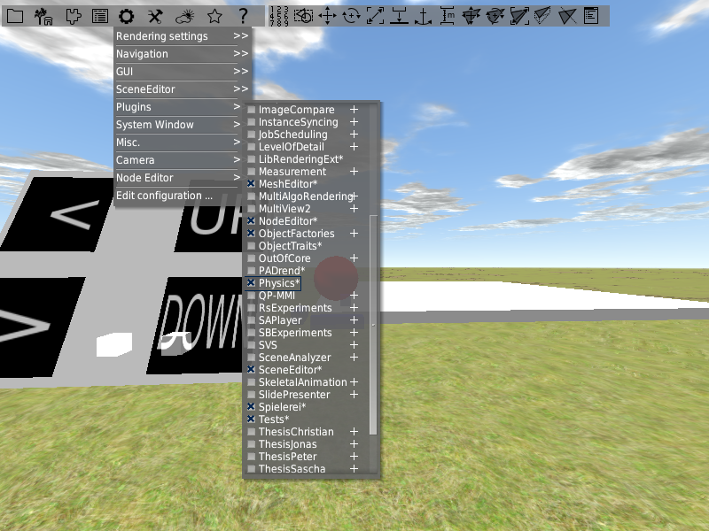

Lets first add physics to the ground plate.
Open it in the object explorer and add a _Physics/CollisionShapeTrait_ to it.
In this way the ground plate acts as a collision shape for other object, so that physic objects can not fall through it.
Also we need to add physics to the ground plate.
Otherwise the collision shape trait would have no effect.
So add a _Physic/PhysicsTrait_ to it.

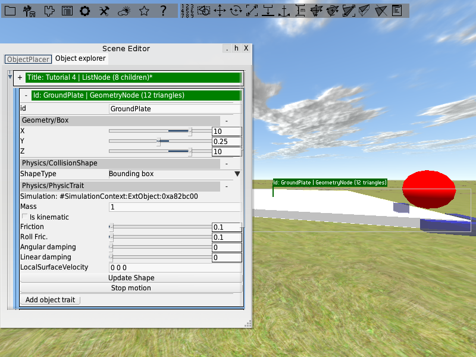

Next up place some of the toy blocks we have used in the second tutorial on the ground plate.
Name them and mark them as semantic objects.
Attach a _Physics/CollisionShapeTrait_ and a _Physic/PhysicsTrait_ to each of them.
In the _Physics/PhysicTrait_ you can set the physic properties of the object (e.g. the mass or the friction).
For now leave the values as they are.
You can play with them later if you like to.

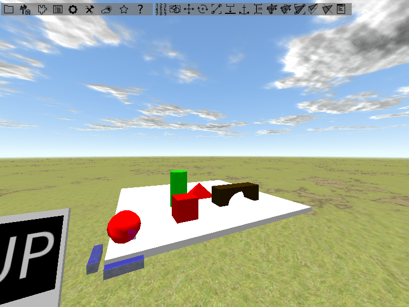

Next up we need to provide our sphere with physics.
We will use its animation to produce collisions with the toy blocks.
Add a _Physics/CollisionShapeTrait_ and a _Physic/PhysicsTrait_ to it.
Open the physics trait and mark the sphere to be an kinematic object.
In this way the sphere can cause collisions but is not effected by them.

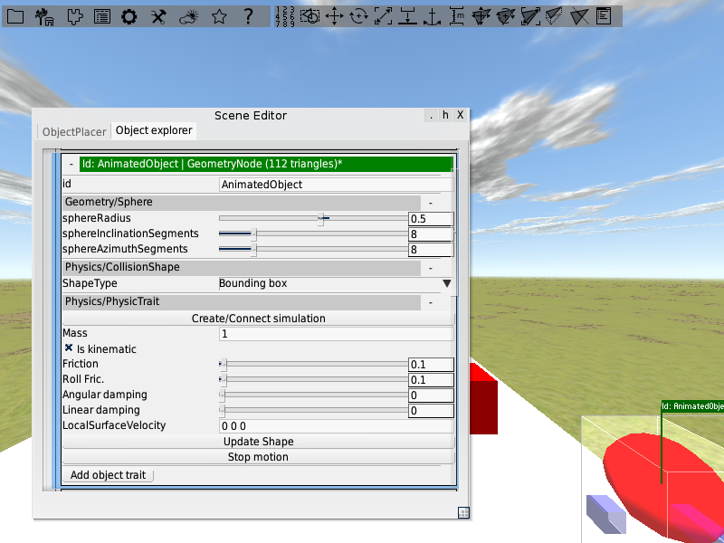

The last thing we have to do is adding a simulation container to the scene.
Open the scenes node in the object explorer.
It is the first in the hierarchy.
Add a _Pyhsics/SimulationContainer_ trait to it.

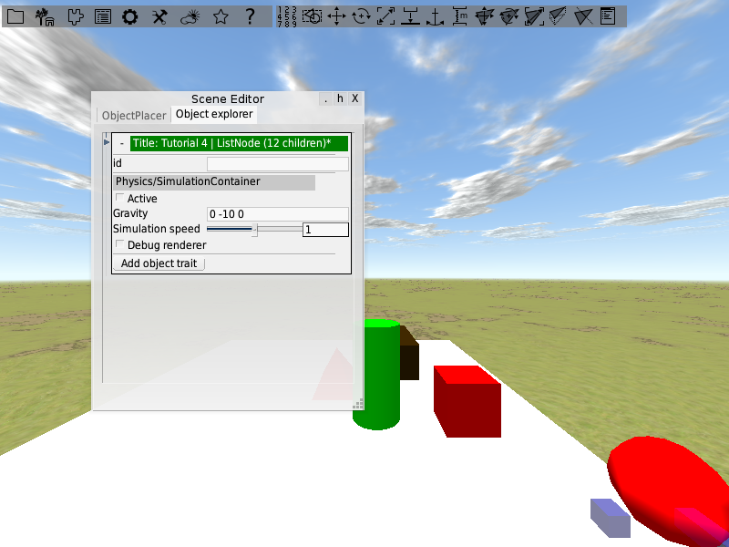

With this trait you can turn the physics on and of by the checkbox _Acitvate_.
It is important that you save the scene before you activate the physics for the first time.
Scene changes that happen as effect of physics can not be undone.
Activate physics and move the sphere around.
When it hits an object, the object will move.
